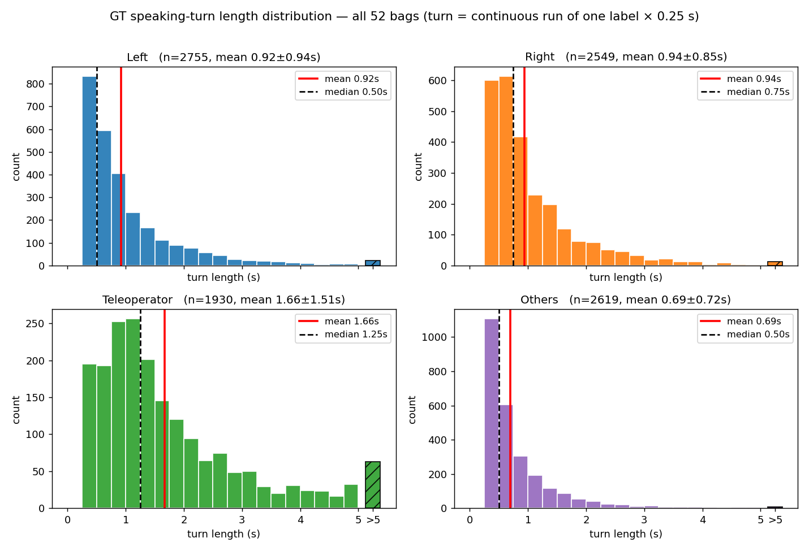

# ワードウルフ実験 行動データ解析 報告

対象：本実験・全13組 × ロボット4条件（Tele / PSSP / DoA / Random）の rosbag、全52局。
各局の観測（room1 音声・映像、room2 映像）から 4Hz グリッド上で5つの注視方策を再計算し、
「誰が発話しているか（GT）」と「各方策がどこを見ようと判断したか」を tick 単位で突き合わせた。
**総 tick 数 = 39,794**（52局 × 平均765 tick ≈ 166分）。
手法の詳細・再現検証：`SPEC.md` / `docs/ros-topics.md` / `docs/validation-report.md`。

---

## 1. 要点

1. **DoA / PSSP は発話者をよく見ている。** 対面参加者が発話している時、正しい側を見た割合（発話者注視率 p_o）は
   **PSSP 0.80・DoA 0.77**（Random 0.50 = 偶然）。
2. **遠隔操作者（Tele）は発話者を追わない**（p_o 0.55 ≈ 偶然）。頭は右寄りにほぼ固定で、首振りは発話者切替の半分以下（§6）。
3. **PSSP の +1s 予測は「左右どちらが話すか」では持続予測に勝つ**（0.55 vs 0.45）**が、4ラベル全体では負ける**。
   原因は PSSP が L/R に偏って予測し、持続的な Teleoperator/Others を過小予測するため（§8）。
4. **DoA だけ首振りが突出して多い**（P(switch) 0.082、他条件の約1.3–1.6倍、§5）。
5. **音響マップ上の発話ターンは実際より短く見える**：無発話区間では環境音（エアコン吹出口）が優勢になり
   ラベルが Others 等へ反転するため。VAD で測った真の発話ターンは平均 **1.46 s**（§4）。

---

## 2. データと5方策の定義

4Hz の各 tick t で、5方策それぞれの「見ようとした先」を再計算した。

| 信号 | 定義 | ラベル |
|---|---|---|
| **GT**（真値） | 音声窓 [t−0.46s, t] のビームフォーミングから抽出したラベル ＝ その瞬間に音響的に優勢な源 | 4値: Left / Right / Teleoperator / Others |
| **DoA** | GT と同じ計算だが窓が [t−0.66s, t−0.2s]（実機の音響マップ生成 0.2s 遅延を反映） | 4値 |
| **PSSP** | DoA と同じ最新窓を末尾とする**直近約5秒**の音響マップ列（2Hz×10フレーム）から SimVP が +0.5/1.0/1.5/2.0s 先の音響マップを予測 → ラベル抽出 | 4値 |
| **Tele** | room2 映像から遠隔操作者の頭部向き（yaw）を検出し、yaw>0 → left | 2値: L / R |
| **Random** | 観測に依存しない乱数ウォーク（切替確率 0.065/tick、再現可能） | 2値 |

- 本報告は方策の**判断（決定レベル）**を扱う。実機の首はホールド・平滑化を経てこれより遅れて動くが、対象外。
  唯一の例外は §5 P(switch) のみ実行レベル（実際のモータ指令）。
- 再計算信号は全52局に存在するため、以降は全局プールで集計する。

---

## 3. 各方策の出力ラベル分布

**定義**：全 tick（n=39,794）に対する各方策の出力ラベルの割合。GT 列＝環境そのもの（音響マップ上で誰が優勢だったか）。
Tele は52局ごとの割合の平均±SD、Tele/Random は L/R のみのため Teleoperator/Others は「–」。

| ラベル | GT（環境） | DoA | PSSP | Tele | Random |
|---|---|---|---|---|---|
| Left | 25.4% | 25.5% | 41.6% | 35.3 ± 16.4% | 49.8% |
| Right | 24.1% | 24.0% | 32.2% | 64.7 ± 16.4% | 50.2% |
| Teleoperator | 32.3% | 32.1% | 20.2% | – | – |
| Others | 18.2% | 18.3% | 6.0% | – | – |

**まとめ**：
- **Others の主な発生源は参加者の頭上にある空調の吹出口（2箇所）**。誰も話していない時はこの環境音が
  音響マップ上で優勢になり、ラベルが Others になる。
- **DoA の分布は GT とほぼ同一** ＝ DoA はその時々の音響優勢を素直に反映する。
- **PSSP は L/R に強く偏る**（L+R 74% vs 実際 50%）。「次にどの参加者が話すか」を予測する設計であり、
  かつ訓練データに遠隔操作者の発話が少ないため、Teleoperator/Others を出しにくい（内訳は §8.3）。
- **Tele は右偏り**（右 65%、ただし操作者間のばらつき大 ±16%）。操作者は発話者を追わず頭をほぼ固定して
  おり、その静止姿勢が右寄りだったため（診断は §6.2）。**Random はほぼ均等**。

---

## 4. 発話ターン長

### 4.1 音響マップ上の連続長（GT-run）

**定義**：GT ラベルが同じ値で連続した長さ（連続 tick 数 × 0.25s）。「音響的に同じ源が優勢であり続けた時間」。

| ラベル | 平均 ± SD (s) | ターン数 |
|---|---|---|
| Left | 0.92 ± 0.94 | 2755 |
| Right | 0.94 ± 0.85 | 2549 |
| Teleoperator | 1.66 ± 1.51 | 1930 |
| Others | 0.69 ± 0.72 | 2619 |
| **Left+Right 計** | **0.93 ± 0.90** | 5304 |

5s を超えるターンは各パネル右端の斜線バーに集約。内訳：

| ラベル | >5s 件数 | 割合 | 最長 |
|---|---|---|---|
| Left | 21 | 0.8% | 10.25 s |
| Right | 13 | 0.5% | 8.50 s |
| Teleoperator | 63 | 3.3% | 18.75 s |
| Others | 8 | 0.3% | 8.50 s |

**まとめ ―― なぜこんなに短いのか**：
- 参加者が話し終える（または一息つく）と、次の瞬間には空調などの環境音が優勢になりラベルが Others 等へ
  反転する。**連続して長く話し続けない限り、発話の合間でターンが切れる**。実際、L/R ターンの終わりの
  65% は相手参加者ではなく Teleoperator/Others への遷移だった。
- 定量的な裏づけ：room1 の音声区間検出（§4.2 の VAD）で見ると、**GT が L/R を出している tick の 33% は
  実は誰も話していない無音区間**（環境音の揺らぎによる見かけのラベル）。
- 各ラベルが映像上で実際どの程度続くかは QC 動画（`bag2video.py`、例: G1_game4_PSSP_sm_qc.mp4）で確認できる（会議で提示予定）。

### 4.2 真の発話ターン（VAD による切分）

**定義**：room1 音声に音声区間検出（VAD）をかけ、「実際に人が話し始めてから途切れるまで」を1ターンとする。
話者は区別しない。**入力と設定**：room1 の16chマイク音声を平均して1chにし、44.1kHz→16kHz へ変換。
silero-vad が **32ms 毎**（約31Hz）に音声確率を出力し、閾値 0.7、最短発話 30ms・最短無音 150ms・前後 50ms
パディングで区間化（境界は 0.25s に量子化されない）。

**結果**：平均 **1.46 ± 1.46 s**（n=3984 ターン、最長 18.3s）。ヒストグラム: `results/metrics/room1_vad_segment_hist.png`。

**まとめ**：真の発話ターンは平均 ~1.5s で、音響マップ上の連続長（0.9s）より長い。
差分は §4.1 の「発話の合間のラベル反転」によるもの。ワードウルフの会話自体も短い発話の応酬が多い。

---

## 5. P(switch)

**定義**：実際にロボットへ送られた首振り指令（実行レベル）の左右反転回数 ÷ 3分窓（720 tick）。各条件13局の平均±SD。

| 条件 | P(switch) |
|---|---|
| Tele | 0.052 ± 0.027 |
| PSSP | 0.060 ± 0.027 |
| **DoA** | **0.082 ± 0.026** |
| Random | 0.062 ± 0.014 |

**まとめ**：**DoA のみ首振りが突出**（他条件の約1.3–1.6倍）。DoA は「今この瞬間の音響優勢」に毎 tick 追従する
ため、短い発話の応酬（§4）がそのまま首振りになる。主観評価で DoA だけ PerceivedSafety が低かったことと整合。

---

## 6. 発話者注視率 p_o

### 6.1 全方策の p_o

**定義**：対面参加者（L/R）が真の発話者である tick（n=19,696、全体の約50%）を母数に、方策がその参加者側を
見た割合。方策が Teleoperator/Others を選んだ場合は「参加者を見ていない」＝ミスと数える。

| 方策 | **p_o** |
|---|---|
| **PSSP** | **0.797** |
| **DoA** | **0.774** |
| Tele | 0.554 |
| Random | 0.500 |

**まとめ**：DoA/PSSP は参加者の発話中、約8割の時間その参加者を見ている。PSSP がわずかに上回るのは
+1s 予測で発話者側へ先回りするため。Random は偶然水準（チェック合格）。

### 6.2 Tele が偶然水準である理由

**定義**：Tele の注視と発話者の関係を分解した診断。

| 観測 | 値 |
|---|---|
| 発話者が Left の時、Tele が左を見た割合 | **41.5%**（偶然未満） |
| 発話者が Right の時、Tele が右を見た割合 | 70.0% |
| Tele の注視切替率（/tick） | **0.074** |
| 発話者の L/R 切替率（/tick） | 0.158 |

**まとめ**：遠隔操作者の頭は右寄りのほぼ固定姿勢（§3：右 65%）で、首振りは発話者切替の**半分以下**。
Left の発話中でも左を見るのは 41.5% しかない。p_o=0.55 は「右固定がたまたま右発話者に当たる」見かけの値で、
発話者を追ってはいない。操作者はゲームの当事者（推理・画面注視）であり、発話者を追う「カメラ係」ではない。

### 6.3 Tele の追従ラグ

**定義**：Tele(t) と GT(t+lag) の一致率を lag を振って比較。負の lag で一致が高い＝過去の発話者を見ている（反応的）。

| lag(s) | −1 | −0.5 | 0 | 0.5 | 1 | 1.5 | 2 | 2.5 | 3 | 5 | 10 |
|---|---|---|---|---|---|---|---|---|---|---|---|
| 一致% | **58.9** | 57.5 | 55.4 | 54.3 | 53.5 | 52.8 | 51.9 | 51.2 | 51.2 | 50.9 | 50.2 |

**まとめ**：ピークは lag=−1s ＝ 追従があるとしても**約1秒遅れの反応的**なもの（先読みではない）。
ピークでも 59% と低く、§6.2 の「緩い追従」と整合。

---

## 7. 方策間の一致（confusion matrix）

行=A、列=B の tick 計数。4ラベル同士は 4×4、L/R 方策を含む対は両者 L/R の tick に絞った 2×2。

### 7.1 DoA vs GT ―― 0.2s 遅延の影響

DoA と GT は同じ計算で窓が 0.2s ずれるだけ。その代価の直接測定（一致 **79.0%**、n=39,794）：

| DoA＼GT | Left | Right | Teleoperator | Others |
|---|---|---|---|---|
| Left | 7792 | 731 | 592 | 1051 |
| Right | 733 | 7449 | 569 | 797 |
| Teleoperator | 569 | 572 | 11227 | 422 |
| Others | 1027 | 823 | 464 | 4976 |

**まとめ**：0.2s の遅延で約2割の tick がずれる。誤りは近接ラベル間で対称的（発話の切り替わり際に集中）。

### 7.2 Tele vs 各方策

| 対 | 一致率 | n |
|---|---|---|
| Tele vs GT | 55.4% | 19669 |
| Tele vs DoA | 55.8% | 19688 |
| Tele vs PSSP | 52.6% | 29328 |

Tele vs GT（55.4%）:

| Tele＼GT | L | R |
|---|---|---|
| L | 4203 | 2859 |
| R | 5905 | 6702 |

Tele vs DoA（55.8%）:

| Tele＼DoA | L | R |
|---|---|---|
| L | 4289 | 2831 |
| R | 5866 | 6702 |

Tele vs PSSP（52.6%）:

| Tele＼PSSP | L | R |
|---|---|---|
| L | 6514 | 3883 |
| R | 10015 | 8916 |

**まとめ**：人間（Tele）とどの自動方策の一致も 52–56% と低い。ロボット方策は「発話者を見る」、
人間は「ほぼ固定＋時々反応」という**質的に異なる行動**をしており、どちらかがどちらかを近似してはいない。

### 7.3 妥当性チェック

PSSP vs Random（49.9%、n=29,370）―― PSSP は乱数と無相関 ＝ 決定は観測に依存している：

| PSSP＼Random | L | R |
|---|---|---|
| L | 8270 | 8284 |
| R | 6425 | 6391 |

Random vs GT（50.0%、n=19,696）―― 乱数は発話者と無相関（設計どおり）：

| Random＼GT | L | R |
|---|---|---|
| L | 5025 | 4757 |
| R | 5096 | 4818 |

---

## 8. PSSP 予測精度

### 8.1 予測地平線別の正解率

**定義**：予測 = PSSP の各地平線ラベル。照合先 = その時刻の GT。基線 = 持続（「h 秒後も今と同じ」と予測）。
L/R 限定 = 実際の発話者が L/R の tick のみを母数とし、Teleoperator/Others と予測した場合も不正解。

| 地平線 | PSSP L/R | 持続 L/R | PSSP 4ラベル | 持続 4ラベル | n(L/R) |
|---|---|---|---|---|---|
| +0.5s | 0.596 | 0.577 | 0.495 | 0.610 | 19649 |
| **+1.0s** | **0.548** | 0.450 | 0.403 | 0.474 | 19596 |
| +1.5s | 0.508 | 0.402 | 0.365 | 0.415 | 19546 |
| +2.0s | 0.483 | 0.368 | 0.344 | 0.380 | 19496 |

**まとめ**：**L/R 限定では全地平線で PSSP が持続に勝ち、先の予測ほど差が開く**（持続は急速に劣化、+2.0s で
0.483 vs 0.368）。一方 **4ラベル全体では持続に負ける**。原因は §8.3。

### 8.2 混同行列（+1.0s）

PSSP vs GT(t+1s)（一致 40.3%、n=39,586）：

| PSSP＼GT(+1s) | Left | Right | Teleoperator | Others |
|---|---|---|---|---|
| Left | 5909 | 2934 | 4578 | 3051 |
| Right | 2540 | 4829 | 3160 | 2241 |
| Teleoperator | 1202 | 1324 | 4384 | 1071 |
| Others | 422 | 436 | 680 | 825 |

基線・持続 GT(t) vs GT(t+1s)（一致 47.4%、n=39,586）：

| GT(t)＼GT(+1s) | Left | Right | Teleoperator | Others |
|---|---|---|---|---|
| Left | 4619 | 1867 | 1930 | 1645 |
| Right | 1894 | 4193 | 1842 | 1615 |
| Teleoperator | 1954 | 1948 | 7460 | 1420 |
| Others | 1606 | 1515 | 1570 | 2508 |

ラベル別 precision / recall（PSSP、参照 = GT(t+1s)）：

| ラベル | precision | recall |
|---|---|---|
| Left | 0.359 | 0.587 |
| Right | 0.378 | 0.507 |
| Teleoperator | 0.549 | 0.342 |
| Others | 0.349 | 0.115 |

### 8.3 なぜ 4ラベルで持続に負けるのか

実際の発話者ラベル別に分解すると：

| GT(t+1s) 実際 | 占比 | PSSP 正解 | 持続 正解 |
|---|---|---|---|
| Left | 25.4% | **0.587** | 0.459 |
| Right | 24.1% | **0.507** | 0.440 |
| Teleoperator | 32.3% | 0.342 | **0.583** |
| Others | 18.2% | 0.115 | **0.349** |

- **PSSP は L/R に偏って予測する**（§3：出力の 74% が L/R、実際は 50%）。L/R では持続に明確に勝つが、
  最も持続的な Teleoperator（ターン平均 1.66s、実際の 32%）と Others を取りこぼす。そこでは
  「今と同じ」と言うだけの持続が有利になり、4ラベル合計では持続が上回る。
- この偏りは**訓練データの性質**とも整合する：PSSP の学習データ（下図の収録シーン）では
  遠隔操作者（スピーカー）が発話している時間が少なく、モデルは Teleoperator を出力しにくい。

**まとめ**：4ラベルでの「負け」は予測が壊れているのではなく、**PSSP は設計・訓練とも「対面参加者の左右
どちらが話すか」に特化した方向予測器**であり、その範囲では持続予測に一貫して勝っている。

---

## 9. limitation と次アクション

**limitation**
- 本解析は方策の判断（決定レベル）のみを対象とし、実機の首の動き（ホールド・平滑による遅れ）は含まない。
- GT は音響マップの argmax であり、発話の重なり・環境音下では真の発話者と一致しない tick を含む（§4）。
- ロボットの首振りが参加者の発話行動へ与える影響（誰が話し始めるか等）は考慮していない。
- 実験導入スライドが参加者の注意をロボットの視線へ誘導した可能性（設計上の交絡）。

**次アクション**
- 会議：QC 動画の提示、PSSP 訓練データ図の確定、要相談事項（PSSP vs Random の解釈の言い回し）。
- PSSP 再学習（新収集データ + Xu データ）の際は、Teleoperator 発話を含むデータで 4ラベル予測の改善余地。
