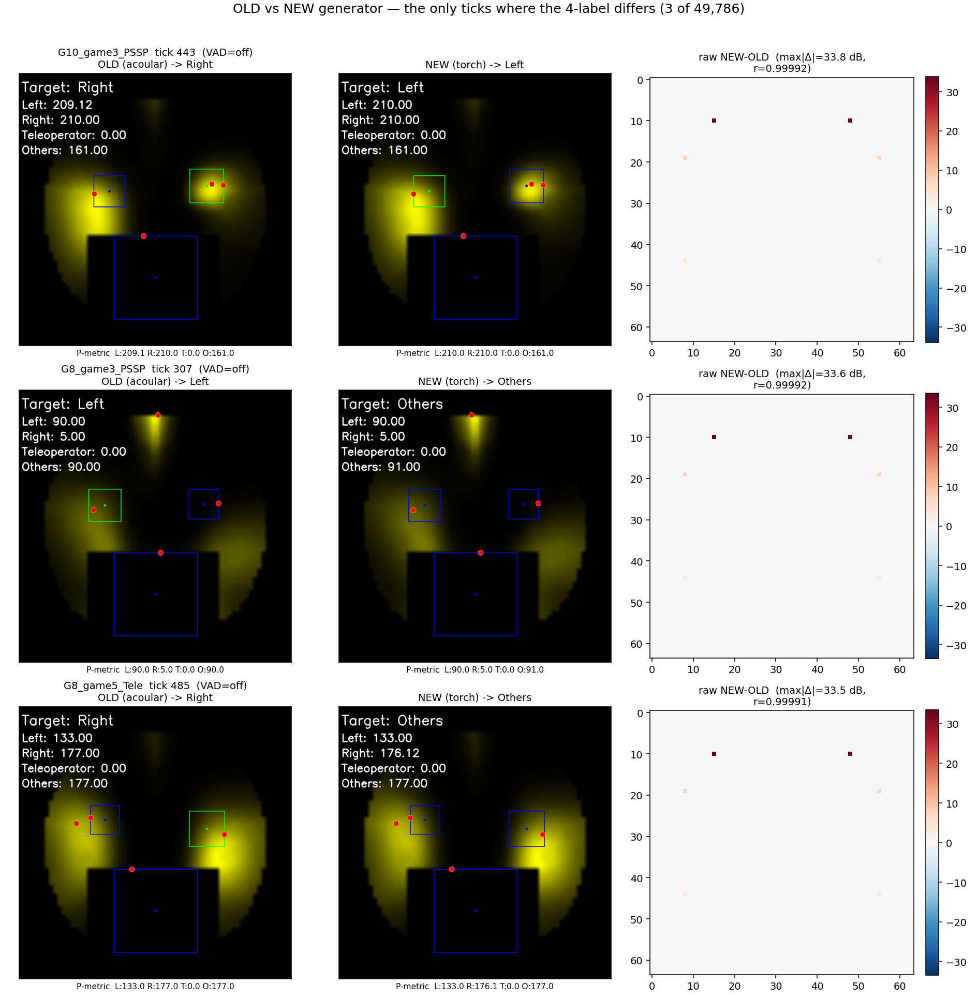

# 音源マップ生成器の新旧比較（OLD acoular → NEW torch）

## 目的
ロボット実機で使用していた **旧生成器**（acoular `BeamformerBase.synthetic`）を、
**新生成器**（PyTorch による 2000–8000 Hz 帯 FFT パワー和）へ差し替えても、
ターゲティング判定（4 ラベル：Left / Right / Teleoperator / Others）が変わらないかを検証した。

## 方法
- 全 **65 bag**（13 グループ × DoA/PSSP/Random/Tele/Video）、4 Hz で計 **49,786 tick**。
- 各 tick で **同一の音声窓**（160 メッセージ）を新旧両生成器へ入力。
- head box（MediaPipe 再検出）・VAD・ラベリング経路も **完全に共通** ── 差が出るのはビームフォーマ部分のみ。

## 結果（全 65 bag 集計）
| 指標 | 値 |
|---|---|
| 4 ラベル一致率 | **99.99%**（Cohen κ = 1.000） |
| L/R 判定一致率（両者が左右を出した tick） | **100.0%** |
| 生マップの相関 r（中央値） | **0.99991** |
| ピーク同一セル率 | ≈100% |
| 判定が食い違った tick | 49,786 中 **わずか 3**（すべて無音時の量子化境界での ±1 同点差） |

→ **新旧の差し替えは判定に無害**。生マップはほぼ完全一致し、`exp(x−max)` のラベリング変換が
低エネルギーセルの差を潰すため、最終判定（argmax）は動かない。

### 唯一食い違った 3 tick（全 49,786 中）
食い違った tick を実際に抽出し、両マップと差分を描画した（左＝旧、中＝新、右＝生マップ差分）。

3 件とも **無音（VAD=off）区間** で、領域メトリクス（uint8, 0–255）が **±1 未満の同点** となり
優先順位（L>R>Tele>Others）でラベルが分かれただけ。生マップ自体は **r≈0.9999** でほぼ一致し、
ピーク位置も完全に同一（右列の差分は端の低エネルギーセルにしか出ていない）。実運用上は無視できる差。

| bag | tick | 旧→新 | 旧メトリクス [L R T O] | 新メトリクス [L R T O] |
|---|--:|---|---|---|
| G10_game3_PSSP | 443 | R→L | 209.1 / 210.0 / 0 / 161 | 210.0 / 210.0 / 0 / 161 |
| G8_game3_PSSP | 307 | L→Others | 90.0 / 5.0 / 0 / 90.0 | 90.0 / 5.0 / 0 / 91.0 |
| G8_game5_Tele | 485 | R→Others | 133.0 / 177.0 / 0 / 177 | 133.0 / 176.1 / 0 / 177 |

## デモ動画：`compare-generator.mp4`（G2_game3_PSSP、40 秒）
左＝旧生成器、右＝新生成器を **同期並置**。上部に速度・一致率、各パネル下部に **1 マップあたりの処理時間** を表示。
- クリップ全体で **4 ラベル一致 160/160（100%）**。発話者の切り替わり（右話者 → 遠隔操作者）も両者同一に追従。
- 処理時間（この PC・単一プロセス実測、新は GPU〈RTX 4070〉）：**旧 186.2 ms/map vs 新 5.7 ms/map ≒ 32.8 倍高速**。
  （旧 acoular は GPU 非対応で CPU のみ。新は CPU でも約 66 ms/map〈約 3 倍〉、GPU 利用でさらに大幅に高速化。）

## 結論
新生成器は旧生成器の **忠実な再実装** であり、ターゲティング判定を一切変えずに **より高速**。
オフライン解析・実機のいずれにおいても **旧 → 新の置き換えは安全** と判断できる。
