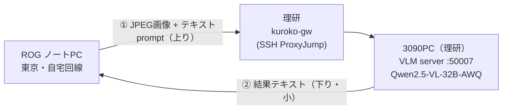

# 音図 × VLM 音源判定 実測レポート

理研の 3090PC 上の VLM に、Word Wolf のシーンを送って「今の音源は誰か」を判定させる実測。

---

## 第1部　実験環境と入力仕様

### 1.1 モデルとPC

| 項目 | 値 |
|---|---|
| PC | 理研 3090PC（NVIDIA RTX 3090, VRAM 24GB） |
| モデル | Qwen2.5-VL-32B-Instruct-AWQ（4bit-AWQ 量子化） |
| VRAM 使用量 | **約 22.4 GB / 24 GB**（モデル本体＋推論時アクティベーション。24GB にほぼ収まる） |
| 最大文脈長 | **128,000 トークン**（テキスト＋画像トークン合計の上限） |
| 画像トークン上限 | 768 トークン|

32B モデルを 4bit-AWQ に量子化することで、重み約 20GB＋実行時で **24GB の 3090 に載る**。
文脈長 128k は本タスク（画像1枚＋短いプロンプト）に対し十分に余裕がある。

### 1.2 入力画像の解像度（以後の全テストで固定）

元の **1080×1080 は 756×756 に縮小**されて VLM に入力される
（画像トークン 729 / 上限 768、28 の倍数へ丸め）。

- したがって **実効入力解像度 = 756×756**。以後のテスト画像・図はすべてこの 756×756 で扱う
  （送信前にクライアント側で 756 に縮小 → 帯域も節約でき、VLM が見るものと一致）。
- 1.4 の品質比較図も、この「VLM が実際に受け取る 756×756」で示す。

### 1.3 データ伝送経路

東京自宅の ROG ノート PC から、理研内網の 3090PC 上 VLM サーバへ JPEG 画像＋プロンプトを送り、
結果テキストを受け取る。理研内網へは網関 `kuroko-gw`（ProxyJump）を二段跳びする SSH トンネル
（`server` は `127.0.0.1:50007` のみ監視、外部非公開）。



送信ペイロード = `[prompt テキスト][JPEG バイト]`、応答 = 結果テキスト（数十バイト）。

### 1.4 JPEG 画質 × 伝送遅延（採用 q の判断材料）

画像 を 756×756 に縮小し、各 JPEG 画質 q でエンコードした際の **ペイロードサイズ**と
**ネットワーク往復（RTT）**。RTT は VLM 推論を挟まない echo 応答で 30 回計測（純伝送）。

| q（画質） | ペイロード | RTT 平均 | RTT 最小 |
|---|---|---|---|
| PNG（無圧縮） | 633 KB | 200 ms | 160 ms |
| **q100** | 312 KB | 110 ms | 84 ms |
| **q90** | 106 KB | 99 ms | 93 ms |
| **q80** | 71 KB | 75 ms | 34 ms |
| **q70** | 56 KB | 59 ms | 27 ms |
| **q60** | 47 KB | 50 ms | 26 ms |
| **q50** | 41 KB | 74 ms | 26 ms |
| **q40** | 36 KB | 48 ms | 25 ms |
| **q30** | 31 KB | 42 ms | 25 ms |

- floor（テキストのみ）≈ 21 ms、エンコード/デコードは各 ~1–2 ms で無視できる。RTT 平均は VPN の
  ジッタで揺れるため最小値も併記（最小値がほぼ実力）。
- **q100 → q90 でサイズが 312 → 106 KB に激減**（約 1/3）するのに見た目はほぼ不変。q70 以下は
  31–56 KB で頭打ち。
- 伝送遅延の差はすべて **~40–110 ms** に収まる。

**品質比較（VLM が実際に受け取る 756×756）**


**採用: q = 100（本試験）**。今回は検証が目的のため、圧縮アーティファクトで結果を汚さないよう
near-lossless の **q100（312 KB, RTT ~110 ms）** を用いる。遅延はどの q でも VLM 推論（~4 秒/枚）
に比べ僅少なので、q100 でも実用上まったく問題にならない。
**実運用では遅延要件に応じて q を下げてよい**（例: q90 でサイズ 1/3・見た目ほぼ同一、q70 でさらに小）
——遅延と画質の対応は上表・上図のとおりで、必要になれば下げればよい。

---

## 第2部　比較手法の定義

以後の全試験でこの入出力形式・プロンプトを用いる（本節で確定、後述では繰り返さない）。

### 2.1 入出力形式（全条件共通）

- **入力** = 756×756 の JPEG 画像（画像トークン 729）＋ テキストプロンプト。
- **出力** = **Left / Right / Teleoperator / Others の 4 ラベルのうち一つのみ**。思考過程・説明・
  記号は出させない（例: 「The person on the right … ANSWER: Right」のような推論文は不可、`Right` だけ）。
- プロンプト = **共通足場**（場面説明＋出力指示）＋ **条件固有の音源情報**。共通足場は全条件で同一なので、
  以下では条件固有部分と合計トークン数（テキストのみ、画像 729 は別）だけを示す。

**共通足場**（`《音源情報》` の箇所に各条件のブロックが入る）:

```
This is a fisheye camera view (756x756 pixels; (0,0) is the TOP-LEFT, x increases right,
y increases down) of a Word Wolf game room with two local players and one remote
teleoperator. Several of these may make sound at the same time; identify the SINGLE
STRONGEST (loudest) sound source, which is one of these four:
- Left        : the LEFT local player is speaking (seated on the left side of the view).
- Right       : the RIGHT local player is speaking (seated on the right side of the view).
- Teleoperator: the REMOTE operator is speaking. They are NOT a visible person; their voice
  always comes from a fixed given box, x=[264,495], y=[452,683] (the lower-centre region,
  over the robot/table).
- Others      : none of the above (the sound comes from elsewhere, or there is no clear
  single source).

《音源情報》

Look at the image and use the information above to determine which ONE of the four is the
STRONGEST sound source right now (if several sound at once, pick the loudest). Then answer
with EXACTLY ONE word — Left, Right, Teleoperator, or Others — and output only that single
word, with no explanation, no reasoning, and no punctuation.
```

### 2.2 baseline（音源情報なし・視覚のみ）— **307 tokens**

音源情報を与えず、画像だけで話者を判定させる下限点。`《音源情報》` に入るブロック:

```
No sound-localization information is given. Judge only from the visual scene (who appears
to be the current speaker).
```

### 2.3 mode_A（テキスト化）

音図の**最強音源の位置**を、「**数値そのまま → だんだん人間語へ**」という抽象度のグラデーションで
与える 3 形式。いずれも同一の「どこが最も強いか」を、表現の抽象度だけ変えたもの（座標は 756 系。
位置は gt を定義したのと同一前段の最強領域代表点から算出、gt ラベル語は不使用）。

以下を例に説明する。この **RGB 画像**（音源は左の話者）を入力とし、`《音源情報》` に各形式のテキストを添える:


各形式の末尾には共通で「**音源情報を最優先し、画像は位置対応づけの補助のみ**（見た目で話者を推測しない）」という
指示が付く（下表に含む。この一文で例1のような視覚バイアスを抑える狙い）。

| 形式 | 抽象度 | `《音源情報》`（上の例の場合） | tokens |
|---|---|---|---|
| **coord** | 数値そのまま | `A sound-localization front-end has located the current strongest sound. Its peak is at image pixel coordinate (253, 301). Decide PRIMARILY from this sound information; use the image only to map the indicated location to one of the four labels — do NOT pick whoever merely looks like they are speaking (mouth, gestures).` | 356 |
| **grid** | 3×3 の最大セル | `A sound-localization front-end has located the current strongest sound. The image is divided into a 3x3 grid (rows 1-3 top to bottom, columns 1-3 left to right). The strongest sound is in the cell at row 2, column 2. Decide PRIMARILY from this sound information; use the image only to map the indicated location to one of the four labels — do NOT pick whoever merely looks like they are speaking (mouth, gestures).` | 385 |
| **nl** | セルを人間語へ | `A sound-localization front-end has located the current strongest sound. It comes from the centre of the view. Decide PRIMARILY from this sound information; use the image only to map the indicated location to one of the four labels — do NOT pick whoever merely looks like they are speaking (mouth, gestures).` | 348 |

### 2.4 mode_B（画像重畳）— **408 tokens**

音図を**黄色で凸結合重畳**（音図×α ＋ RGB×(1−α)）した画像を与える。α = **0.3 / 0.5 / 0.7** を掃引。
`《音源情報》` に入るブロック（α に依らず同一）:

```
A translucent YELLOW sound-energy heatmap has been overlaid on top of this scene. Brighter /
more saturated yellow means higher sound energy at that location, while dark, un-highlighted
areas are quiet. The single brightest yellow region marks where the sound is coming from
right now. Read the position of that bright-yellow region relative to the left/right players
and the lower-centre teleoperator region. Decide PRIMARILY from this overlay (where the
brightest yellow is); use the image only to map that location to one of the four labels —
do NOT pick whoever merely looks like they are speaking (mouth, gestures).
```

**α 比較（VLM 実効入力 756×756。同じ例のシーンで、α が大きいほど音図が濃く、RGB が暗くなる）**


### 2.5 combo（coord ＋ α=0.5 の結合）— **379 tokens**

mode_A の最良（**coord**）と mode_B の最良（**α=0.5 重畳**）を**両方**与える結合手法。入力画像は
**α=0.5 の重畳画像**、音源情報は「黄色重畳がある ＋ 最強音源のピーク座標」の両方を渡す（2 モダリティが
同じ位置を補強し合う"最強手法"の候補）。`《音源情報》` に入るブロック（座標は例の値）:

```
A translucent YELLOW sound-energy heatmap is overlaid on the scene (brighter yellow =
louder). In addition, a localization front-end reports the strongest sound at image pixel
coordinate (253, 301). Use BOTH the overlay and this coordinate together. Decide PRIMARILY
from this sound information; use the image only to map the indicated location to one of the
four labels — do NOT pick whoever merely looks like they are speaking (mouth, gestures).
```

---

## 第3部　本試験（Word Wolf G1_game3）

**Word Wolf G1_game3_Tele の全 756 tick**（1 ゲームの全フレーム）で 8 手法を評価。入力は §第2部の
定義どおり（756×756 JPEG q100 ＋各条件のプロンプト、出力は 4 ラベルのみ）。gt 分布は
**Left 264 / Right 185 / Teleoperator 243 / Others 64**、未パース 0。

| 手法 | 正解率 | 平均遅延 | Left P/R | Right P/R | Teleoperator P/R | Others P/R |
|---|---|---|---|---|---|---|
| baseline（視覚のみ） | **34.8%** | 1.80s | 38% / 61% | 31% / 56% | — / 0% | — / 0% |
| mode_A: coord | **91.5%** | 1.84s | 81% / 100% | 98% / 100% | 100% / 100% | — / 0% |
| mode_A: grid(3×3) | **83.3%** | 1.85s | 80% / 91% | 97% / 80% | 80% / 100% | — / 0% |
| mode_A: nl | **83.2%** | 1.84s | 80% / 91% | 97% / 79% | 79% / 100% | — / 0% |
| mode_B: α=0.3 | **73.9%** | 1.96s | 96% / 52% | 83% / 97% | 61% / 100% | — / 0% |
| mode_B: α=0.5 | **90.9%** | 1.95s | 86% / 98% | 97% / 100% | 92% / 100% | — / 0% |
| mode_B: α=0.7 | **90.2%** | 1.95s | 85% / 97% | 97% / 99% | 91% / 99% | — / 0% |
| **combo: coord + α=0.5** | **91.5%** | 1.82s | 82% / 100% | 97% / 100% | 99% / 100% | — / 0% |

（P/R = precision / recall。正解率のランダム基線 25%。平均遅延はラベルのみ出力のため ~2s/枚。）

### 考察

- **視覚のみ（baseline）は 34.8% とランダム基線（25%）並み**。Left/Right を当てずっぽうに振る程度で
  Tele・Others の recall は 0%、音源手がかり無しでは話者を当てられない。→ 音源情報の追加が必要。
- **音源情報を足すと大幅改善**。mode_A は **coord（数値そのまま）91.5% が最良**、grid(3×3)・nl も
  83%（＝座標をそのまま渡すほど強い。粗い離散化・人間語化で少し落ちる）。
- **mode_B は α（不透明度）依存**。α0.3 は 73.9% だが **α0.5 / 0.7 で 90% 前後**に達し、テキスト最良
  （coord 91.5%）に匹敵。十分濃い重畳なら画像でも高精度。
- **combo（coord ＋ α=0.5）は 91.5%** で coord と同率・最上位。集計上は「明示座標」が支配的で重畳の上乗せは
  ほぼ無いが、**個別例では最も頑健**（第4部: 例1 Tele・例2 Left・例3 Right をすべて正解＝各手法の弱点を相互補完）。
- **Others はどの手法も recall ≒ 0%**（最強ピークが人の近傍に落ち Left/Right/Teleoperator に
  吸われる）。「誰でもない」の弁別は音図の位置情報だけでは難しく、共通の弱点。
- **Others の"外し方"は手法で異なる**: 環境音（上方エアコン等）でも **coord は最強座標を最寄りの可視の人に
  落とす**（上中央 AC 系 18 件で全て Left）。一方 **mode_B(重畳)は「人に乗っていない」と気づくが、それを
  Teleoperator（＝非可視音源の兜底）に振る**（同 18 件で Tele 15）。どちらも Others には至らない。
- 3 話者（Left/Right/Teleoperator）に限れば coord・combo・mode_B(α≥0.5) は各 recall ~100%。

---

## 第4部　個別例

4 つの例シーンで各手法の実入出力を示す（precision/recall・混同行列は載せない）。入力は 756×756 q100。
baseline / mode_A は素の **RGB** を入力（画像は再掲しない）。mode_B は各シーンの **α 重畳画像**（下図）を入力。
（mode_A の「音源情報」欄は位置部分のみ表示。共通の前置き・優先度の一文は §2.3 参照。）

### 例1（gt = Teleoperator）


この例のシーン（α=0.3/0.5/0.7 の重畳＝mode_B の入力。素の RGB が baseline / mode_A の入力）

| 手法 | 入力 | 音源情報（プロンプト該当部） | VLM 出力 | 正誤 |
|---|---|---|---|---|
| baseline | RGB | No sound-localization information is given. Judge only from the visual scene (who appears to be the current speaker). | **Right** | ✗ |
| mode_A: coord | RGB | … Its peak is at image pixel coordinate (377, 587). | **Teleoperator** | ✓ |
| mode_A: grid(3×3) | RGB | … The image is divided into a 3x3 grid (rows 1-3 top to bottom, columns 1-3 left to right). The strongest sound is in the cell at row 3, column 2. | **Teleoperator** | ✓ |
| mode_A: nl | RGB | … It comes from the bottom-centre of the view. | **Teleoperator** | ✓ |
| mode_B: α=0.3 | α=0.3 重畳 | §2.4 の黄色重畳プロンプト（全 α 共通） | **Right** | ✗ |
| mode_B: α=0.5 | α=0.5 重畳 | §2.4 の黄色重畳プロンプト（全 α 共通） | **Teleoperator** | ✓ |
| mode_B: α=0.7 | α=0.7 重畳 | §2.4 の黄色重畳プロンプト（全 α 共通） | **Teleoperator** | ✓ |
| **combo: coord + α=0.5** | α=0.5 重畳 | α=0.5 重畳 ＋ ピーク座標を両方提示（§2.5） | **Teleoperator** | ✓ |

**この例の所見**: 遠隔操作者（下中央）が音源。mode_A は 3 形式とも正解。**§2.4 で追記した「音源情報を最優先・画像は補助」の
一文が効き**、以前は視覚バイアス（右の人が笑って見える）で Right に流れていた **mode_B も α≥0.5 で Teleoperator に改善**
（α=0.3 は重畳が薄く依然 Right）。baseline のみ視覚だけで Right の誤り。この一文追加が「非可視音源で視覚に引っ張られる」
mode_B の弱点を緩和する好例。

### 例2（gt = Left）


この例のシーン（α=0.3/0.5/0.7 の重畳＝mode_B の入力。素の RGB が baseline / mode_A の入力）

| 手法 | 入力 | 音源情報（プロンプト該当部） | VLM 出力 | 正誤 |
|---|---|---|---|---|
| baseline | RGB | No sound-localization information is given. Judge only from the visual scene (who appears to be the current speaker). | **Right** | ✗ |
| mode_A: coord | RGB | … Its peak is at image pixel coordinate (253, 301). | **Left** | ✓ |
| mode_A: grid(3×3) | RGB | … The image is divided into a 3x3 grid (rows 1-3 top to bottom, columns 1-3 left to right). The strongest sound is in the cell at row 2, column 2. | **Teleoperator** | ✗ |
| mode_A: nl | RGB | … It comes from the centre of the view. | **Teleoperator** | ✗ |
| mode_B: α=0.3 | α=0.3 重畳 | §2.4 の黄色重畳プロンプト（全 α 共通） | **Right** | ✗ |
| mode_B: α=0.5 | α=0.5 重畳 | §2.4 の黄色重畳プロンプト（全 α 共通） | **Left** | ✓ |
| mode_B: α=0.7 | α=0.7 重畳 | §2.4 の黄色重畳プロンプト（全 α 共通） | **Left** | ✓ |
| **combo: coord + α=0.5** | α=0.5 重畳 | α=0.5 重畳 ＋ ピーク座標を両方提示（§2.5） | **Left** | ✓ |

**この例の所見**: 左の話者が音源。**coord のみ正解**。grid / nl は座標 (253,301) が 3×3 の中央セル（row2,col2）に
丸められ、「中央 ≒ 下中央の遠隔操作者」と誤読して Teleoperator に（＝粗い離散化の弊害、§第3部で grid/nl が
coord に劣る一因）。mode_B は α=0.3 で Right 誤り、**α≥0.5 で Left 正解**（十分な濃さが要る）。

### 例3（gt = Right）


この例のシーン（α=0.3/0.5/0.7 の重畳＝mode_B の入力。素の RGB が baseline / mode_A の入力）

| 手法 | 入力 | 音源情報（プロンプト該当部） | VLM 出力 | 正誤 |
|---|---|---|---|---|
| baseline | RGB | No sound-localization information is given. Judge only from the visual scene (who appears to be the current speaker). | **Left** | ✗ |
| mode_A: coord | RGB | … Its peak is at image pixel coordinate (536, 298). | **Right** | ✓ |
| mode_A: grid(3×3) | RGB | … The image is divided into a 3x3 grid (rows 1-3 top to bottom, columns 1-3 left to right). The strongest sound is in the cell at row 2, column 3. | **Right** | ✓ |
| mode_A: nl | RGB | … It comes from the right side of the view. | **Right** | ✓ |
| mode_B: α=0.3 | α=0.3 重畳 | §2.4 の黄色重畳プロンプト（全 α 共通） | **Right** | ✓ |
| mode_B: α=0.5 | α=0.5 重畳 | §2.4 の黄色重畳プロンプト（全 α 共通） | **Right** | ✓ |
| mode_B: α=0.7 | α=0.7 重畳 | §2.4 の黄色重畳プロンプト（全 α 共通） | **Right** | ✓ |
| **combo: coord + α=0.5** | α=0.5 重畳 | α=0.5 重畳 ＋ ピーク座標を両方提示（§2.5） | **Right** | ✓ |

**この例の所見**: 右の話者が音源で、座標 (536,298) が明確に右列（grid row2,col3 / nl「right side」）。baseline だけ
外し（Left）、mode_A・mode_B は全形式・全 α で正解——**位置が端に寄った素直な例では、テキストでも重畳でも安定して当たる**。

### 例4（gt = Others）


この例のシーン（α=0.3/0.5/0.7 の重畳＝mode_B の入力。素の RGB が baseline / mode_A の入力）

| 手法 | 入力 | 音源情報（プロンプト該当部） | VLM 出力 | 正誤 |
|---|---|---|---|---|
| baseline | RGB | No sound-localization information is given. Judge only from the visual scene (who appears to be the current speaker). | **Right** | ✗ |
| mode_A: coord | RGB | … Its peak is at image pixel coordinate (382, 69). | **Left** | ✗ |
| mode_A: grid(3×3) | RGB | … The image is divided into a 3x3 grid (rows 1-3 top to bottom, columns 1-3 left to right). The strongest sound is in the cell at row 1, column 2. | **Left** | ✗ |
| mode_A: nl | RGB | … It comes from the top-centre of the view. | **Left** | ✗ |
| mode_B: α=0.3 | α=0.3 重畳 | §2.4 の黄色重畳プロンプト（全 α 共通） | **Teleoperator** | ✗ |
| mode_B: α=0.5 | α=0.5 重畳 | §2.4 の黄色重畳プロンプト（全 α 共通） | **Teleoperator** | ✗ |
| mode_B: α=0.7 | α=0.7 重畳 | §2.4 の黄色重畳プロンプト（全 α 共通） | **Teleoperator** | ✗ |
| **combo: coord + α=0.5** | α=0.5 重畳 | α=0.5 重畳 ＋ ピーク座標を両方提示（§2.5） | **Teleoperator** | ✗ |

**この例の所見**: 音源はどの人・遠隔者ボックスにも属さない **Others**——優勢ピークは座標 (382,69)＝**上中央の天井
エアコン吹き出し口**（両プレイヤーから ~395px 離れ、Others が明確に優勢）。**黄色は天井のみに乗り、どちらの人にも
掛かっておらず gt=Others は曖昧さがない**。にもかかわらず **全 8 手法が誤答**（coord/grid/nl→Left、mode_B/combo→
Teleoperator、baseline→Right）——座標が明確に「人でない上方」を指しても、VLM は Others を出さず最寄りの人／遠隔者に
振ってしまう。第3部で全手法 Others recall ≈ 0 だった弱点の、最も明快な例。

**combo（coord ＋ α=0.5）の総括**: 4 例中、解ける 3 例（例1 Tele・例2 Left・例3 Right）を**すべて正解**し、各手法が
個別に外す弱点（例1 の重畳、例2 の grid/nl、例3 の baseline）を相互補完した。唯一 例4（Others）は他手法と同じく外す。
集計（第3部）では coord と同率（91.5%）だが、"取りこぼしにくさ"では最も安定。
