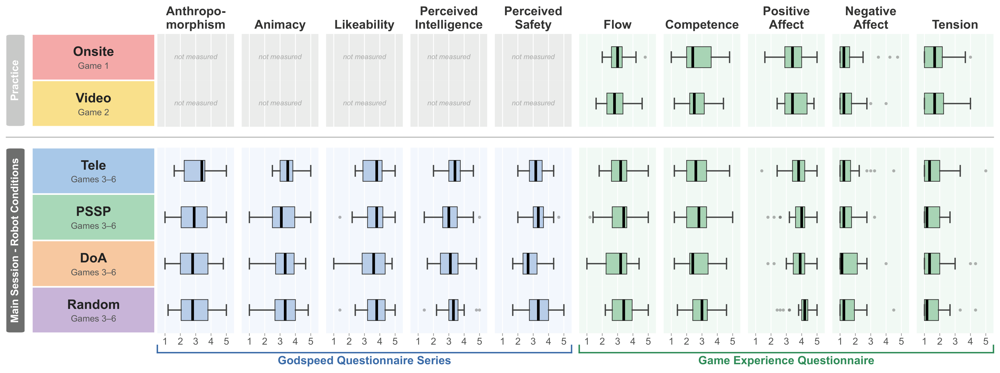

# Paper 5 — Experiment Results Digest (main study, complete)

> Self-contained distillation of the player-experiment analysis (`report2.md`, 2026-06-27).
> **The experiment is finished and the result did not go well.** Whether Paper 5 becomes a
> submission or is folded into the thesis is **not yet decided** — this doc records the
> obtained results only, not a publication decision.

## Setup as run
- **Dates / sample:** 2026-06-15–19 (1 dry run + **13 groups × 3 = 39 participants**). 22 M / 17 F, age 26.3 ± 9.1. Word Wolf familiarity 94.9%.
- **Per group:** ~1.5 h. **6 games:** G1 **Onsite**, G2 **Video** (fixed order, context), G3–6 = four robot modes **Tele / PSSP / DoA / Random** randomized. Post-game interview 5–15 min.
- **Primary hypothesis:** PSSP > DoA, Random (Tele = human reference).

## Headline outcome — primary hypothesis NOT supported

- **GQS (robot impression, confirmatory):** 4/5 subscales show **no group difference**. Only **PerceivedSafety** has a significant overall effect (p = .042) — but this is **DoA being *low*** (over-switching), **not PSSP being high**. PSSP does not beat Random and is on par with Tele.
- **GEQ (game experience, exploratory):** 5/5 subscales **no group difference**.
- **Wolf-guess accuracy:** all conditions 50–58% = chance, no difference.
- **PSSP−Random / PSSP−Tele point estimates ≈ 0** (−0.13…+0.15) — not a "needs more N" situation.

## Teleoperation perception (PTL) — uninformative
- PTL (Perceived Teleoperation-Likeness, 0–100% from yes/no + confidence). Mixed model overall effect **F(3,80.5)=2.17, p=.097 (n.s.)**; residuals non-normal (Shapiro p<.001), so estimates are indicative only.
- **Even true-human Tele sits at chance** (PTL 50% / Yes 54%). Random highest (69%), PSSP lowest (44%). Because the human-operated upper bound is itself unidentified, **PTL cannot rank the conditions** (metric insensitivity and/or teleop embodiment not conveying "humanness"; plus acquaintance bias and large individual gaze-preference variance).

## Behavioral analysis — the one solid finding
From robot logs (rosbag). Acoustic scene (who spoke) is ~equal across modes, so only gaze policy differs.
- **Gaze-on-speaker (Cohen's κ, chance-corrected):** **PSSP κ=0.34, DoA κ=0.31** (follow speaker above chance); **Random κ=0.04** (chance); Tele κ=0.16 (partial). → **PSSP genuinely tracks the speaker; Random does not.**
- **Switch rate P(switch):** Tele .057 / PSSP .064 / **DoA .081** (outlier-high) / Random .061. DoA's excess switching aligns with its low PerceivedSafety.
- **Behavioral similarity (1−JS):** **PSSP–Random most similar (0.958)**; DoA the outlier. Tele/PSSP/Random nearly indistinguishable in switch dynamics.
- **Crux:** PSSP and Random move almost identically (*how* it moves) but choose targets very differently (*who* it looks at) — yet subjective ratings are equal.

## The mechanistic takeaway (negative but clear)
**Semantically correct social gaze (whom to look at) is not reflected in participant perception; evaluation is dominated by motion dynamics (how it moves — switch speed, smoothness, "pauses", regularity).** Post-game interviews (multiple groups, independently) judged human-vs-robot by movement *quality*, not gaze target — corroborating the quantitative behavior↔perception dissociation. Confounds: acquaintance bias (friends recognizing each other's habits), large individual gaze-preference differences, bimodal "all natural / all robotic" judgments.

### Scope of the conclusion — what it does and does NOT license
Two claims must be kept separate. **(A) Functional correctness:** PSSP *does* select the right target (κ=0.34) while Random does *not* (κ=0.04) — objectively different behavior. **(B) Perceptual value:** in this study that correctness produced no measurable subjective improvement. The result supports B, not "A is worthless." It does **not** prove *"PSSP target selection is useless / Random is sufficient."* Reasons that bound the conclusion:
1. **Null ≠ no effect, and the instrument failed its own positive control:** even true-human Tele was at chance on PTL, so the subjective stack cannot be trusted to *prove* targeting is irrelevant (plus small N, incomplete within-subject design, acquaintance bias, bimodal ratings). Absence of evidence, not evidence of absence.
2. **Degenerate 2-target symmetric layout:** with only Left/Right, Random is ~50% correct by chance (p_o=0.514). "Random suffices" is an artifact of this geometry; with more / asymmetric targets, Random's hit rate collapses while PSSP's does not.
3. **Targeting had no task consequence:** in Word Wolf, being looked at (or not) does not change a participant's goal or outcome, so correct targeting was never rewarded. This says nothing about settings where the gaze target *is* consequential (turn-taking handoff, addressee selection, "who to serve" — the field-run regime).
4. **Random's parity has a non-generalizable mechanism:** interviews show Random accidentally produced *both* eye-contact and avoidance, coincidentally satisfying both gaze-seeking and gaze-averse participants — a statistical fluke of random switching in a symmetric binary layout, not a property that transfers.

**Legitimate reading (scoped):** *in a low-stakes, 2-target, symmetric setting, measured with this subjective stack, target-selection correctness was not the perceptual bottleneck — motion dynamics were.* This is a finding about **impression/perception in this setting**, not about PSSP's functional utility for choosing where to attend.

## Reported incidents (validity notes)
- G7: teleoperator headset mis-worn → operator audio faint that game.
- Facilitator/participants spoke quietly (onsite seating close); from 6/16 onsite players asked to speak up (not enforced).
- G8/G10: 1 participant each manually overwrote auto-filled check fields (mis-entry). G12: 1 participant inverted a GEQ 1–5 scale (data reversed/cleaned). G1: questionnaire instruction sheet mistaken for answer field (layout fixed same day).

## Options on the table (undecided)
- **A. Perception-mechanism short paper / workshop / LBR:** frame PSSP as a "correctly-targets-but-unperceived probe"; thesis = *motion dynamics dominate social perception*. Null-centered, so full-conference solo acceptance unlikely.
- **B. No standalone paper; absorb as a thesis chapter** ("negative finding on perception of autonomous social gaze + measurement method").
- Recommended next, low-cost on existing data: per-game behavior→perception regression (predict ratings from P(switch), κ) and quantify rating variance/bimodality; if the mechanism claim holds → A, else → B. Either way the analysis assets are not wasted.

## Relevance to Paper 6
- The **measurement stack and analysis machinery are validated and reusable** (teleop-avatar paradigm, shared target-selection framework, GQS/GEQ + behavioral logs + mixed-effects models) — this is what Paper 6 borrows, independent of Paper 5's negative outcome.
- **Cautionary input for Paper 6's field run:** in this setting, *correct* anticipatory targeting did not translate into perceived improvement; motion dynamics dominated. Paper 6's integration story and field evaluation should account for this (manage low-level motion quality; don't assume "perceives correctly" ⇒ "perceived as better").
- **But targeting value is task-dependent:** the field run is a regime where the gaze target *has* functional consequence (who is addressing the robot, who to serve next), unlike Word Wolf. The Paper 5 null is scoped to a no-consequence, 2-target task (see "Scope of the conclusion") and must **not** be carried over as "Random suffices" for the field deployment.
