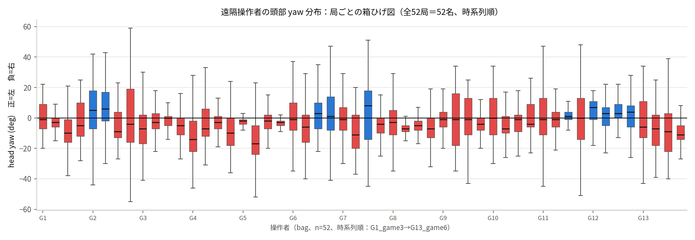
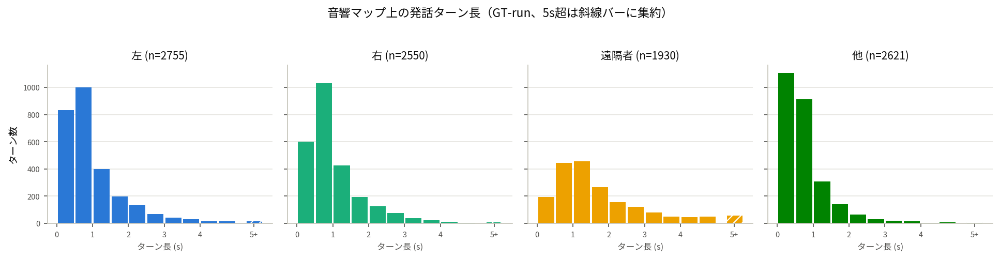
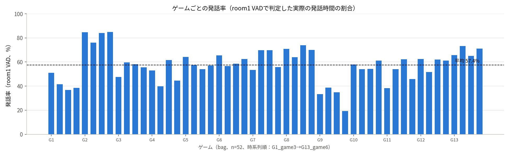
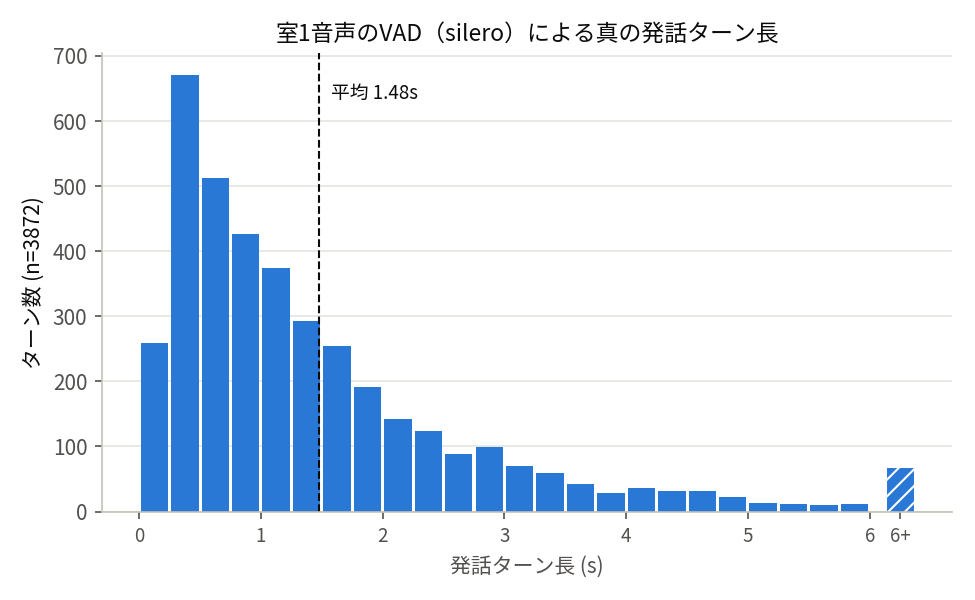
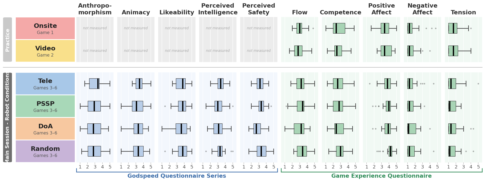

# ワードウルフ実験 行動データ解析 報告

## 0. 要点

### 0.1. 結果

| 何を見たか | 節 | 主な結果 |
|---|---|---|
| 各モードの出力ラベル分布 | 2.1・2.2 | PSSPは左右に強く偏り遠隔者を出しにくい／Teleは右65%偏り（操作者の静止姿勢が原因で、発話者追従によるものではない） |
| 実行レベルの首振り頻度P(switch) | 2.3 | DoAのみ突出（他条件の1.3〜1.6倍） |
| 発話ターンの長さ | 3 | 左右のターンは平均0.9s、遠隔者は1.7sと長い／room1全体では平均1.5s（中央値1.1s） |
| PSSPの1秒後発話者予測の精度 | 4.1.1 | 「左+右」限定 **54.8%**（持続基線45.0%・偶然水準50%を上回る）／4ラベル全体 **40.3%**（持続基線47.4%を下回る） |
| 遠隔操作者の動作と各モード出力との類似度 | 4.2 | DoA 55.8% > PSSP 52.6% > RAND 50.3%（偶然水準） |
| 遠隔操作者の追従ラグ（GTとの時間差） | 4.3 | 最良一致率でも **58.9%**（lag=−1s）——どのlagでも60%を超えない |
| Randomのベースライン妥当性（GTとの一致率） | 4.4 | 50.0%／49.9%（偶然水準） |
| ロボットへの印象の群間差（GQS、確認的） | 5.4 | 4/5尺度で群間差なし。PerceivedSafetyのみ有意（p=.042）だが内訳はPSSPの優位ではなくDoAの低下 |
| ゲーム体験の群間差（GEQ、探索的） | 5.4 | 全5尺度で群間差なし |
| 主観評価と遠隔操作信念の関係 | 5.5 | 「人が操作していると思う」群はGQS 4/5尺度で有意に高い（d=0.49–0.73）／PerceivedSafety・GEQ全5尺度は信念と無関係 |

### 0.2. 結論

1. **行動レベルでは方策間の差を検出できる**：PSSPの+1s発話者予測は「左右どちらが話すか」の判別で偶然水準
   （50%）・持続予測ベースライン（45.0%）を上回る（54.8%、4.1.1）。tick単位の一致率解析により、モード間の
   行動的な差は明確に測定できる（ただし4ラベル全体では持続予測に劣り、優位は限定的）。
2. **真の人間操作者（TELE）も発話者を追従していない**：遠隔操作者自身、右偏り65%・姿勢を固定しがちで
   （2.1・2.2）、GTとの一致は最良のタイミング補正でも58.9%にとどまる（4.3）。「発話者を追う」という設計
   目標は、モデルだけでなく人間の操作者においても、この具身条件では実行されていない。
3. **主観評価はどの方策でも動かない**：GQS 4/5尺度・GEQ 5/5尺度で群間差なし。唯一有意なPerceivedSafetyも
   PSSPの優位ではなくDoAの低下（5.4）。注視目標を真の人間操作者の選択（TELE）に置き換えても、印象評価は
   自主条件と変わらない。
4. **結論（先読み注視の知覚的効果の限界）**：先行の小規模実験と違い、本実験は注視目標の選択を底層の動作
   実装から切り離した（動作ロジックは全モード共通）。それでも**予測ベースの先読み注視（PSSP）は、偶然水準の
   方策（Random）と比べて社会的知覚を改善しない**——先行の一体実装で見えたPSSPの優位は、結合していた動作
   実装の差に由来していた可能性が高い。なお本実験は「注視目標の正確さ」を直接操作していない（PSSPのL/R精度は
   54.8%で完璧ではなく、完全に正しいGT注視は実機で走らせていない）ため、主張は「先読み的な注視方策が知覚を
   動かさない」に限定し、「正しく見ても効果がない」とまでは踏み込まない。知覚と関連していたのは、注視の
   **対象**（誰を見るか）ではなく、注視の**運動学的側面**（どう切り替えるか；ただしこれは注視目標選択から
   派生する量であって独立変数ではない、示唆）と、ユーザーの**信念**（人だと思うか、相関）であった。論文と
   しての詳しい位置づけ・想定タイトル・投稿先の検討は [pick-journal.md](pick-journal.md) を参照。

---

## 1. データの定義

4Hz の各 tick t で、5モードそれぞれの「ラベル」を再計算する。
 - Ground Truth (GT)、DoA、PSSPは音響マップに基づき、4つの選択肢（左/右/遠隔者/他）からラベル抽出
 - Teleは、遠隔操作者の頭部向き(yaw)に基づき、2つの選択肢（左/右）からラベル抽出
 - Randomは、観測に依存しない乱数ウォークで、2つの選択肢（左/右）からラベル決定

### 1.1. 判断基準
*　音響マップは「160 * 128 / 44100 = 0.46s」の音声窓から生成。
* ロボット動作の不応期処理は考慮しない。

| モード | t時刻においての判断基準 |　
|---|---|
| GT | 真値、音声窓 [t−0.46s, t] から音響マップを生成する |
| DoA | 音声窓 [t−0.66s, t−0.2s]から音響マップを生成する（音響マップ生成 0.2s 遅延を反映） |
| PSSP | 直近5秒間の情報(音響マップ2Hz * 10枚)を入力とする。最新の音響マップはDoAと同じ。+0.5/1.0/1.5/2.0s 先の音響マップを予測 |
| Tele | 遠隔操作者の「最新写真(30Hz)」を処理(4ms)、観測の遅延最大は0.033s |
| Random | 観測非依存、無遅延 |

## 2. マニピュレーションチェック

### 2.1. ラベル分布

4Hz の全 tick（n=39,794、52局）における各モードの出力ラベルの割合。

| ラベル | GT | DoA | PSSP +0.5s | PSSP +1.0s | PSSP +1.5s | PSSP +2.0s | Tele | Random |
|---|---|---|---|---|---|---|---|---|
| 左 | 25.4 ± 10.2% | 25.5 ± 10.2% | 37.2 ± 15.3% | 41.6 ± 17.7% | 40.2 ± 19.0% | 36.7 ± 19.5% | 35.3 ± 16.4% | 49.9 ± 6.6% |
| 右 | 24.1 ± 9.7% | 24.0 ± 9.6% | 30.0 ± 12.7% | 32.2 ± 14.7% | 34.2 ± 16.4% | 38.2 ± 18.0% | 64.7 ± 16.4% | 50.1 ± 6.6% |
| 遠隔者 | 32.2 ± 9.8% | 32.1 ± 9.7% | 25.8 ± 10.2% | 20.1 ± 10.1% | 18.8 ± 10.1% | 18.8 ± 10.4% | – | – |
| 他 | 18.2 ± 8.3% | 18.3 ± 8.4% | 7.0 ± 6.5% | 6.0 ± 6.1% | 6.9 ± 6.6% | 6.3 ± 6.3% | – | – |

- ラベル「他」の主な発生源は空調の吹出口（2箇所）。誰も話していない時はこの環境音が音響マップ上で優勢になる。
- DoA の分布は GT とほぼ同一。
- PSSP は 「左・右」 に強く偏る。訓練データに遠隔操作者の発話が少ないため、「遠隔者」 を出しにくい。
- Random はほぼ均等。
- Tele は右偏り（右 65%、ただし操作者間のばらつき大 ±16%）。操作者は発話者を追わず頭をほぼ固定して
  おり、その静止姿勢が右寄りだったため。

### 2.2. Tele のラベル分布が右偏りの検証

*　Yaw > 0 -> 左
*　ほぼ全部「右」の「G5 game4」の遠隔操作者のビデオを確認した。姿勢はずっと右寄り、大半の時間はモニターを見ない（話者を追従しない）。左を見る際に目だけで動くことが多い。

### 2.3. P(switch)

定義：実際にロボットへ送られた首振り指令（実行レベル）の左右反転回数 ÷ tick数。

| 条件 | Tele | PSSP | DoA | Random |
|---|---|---|---|---|
| P(switch) | 0.052 ± 0.028 | 0.059 ± 0.028 | **0.081 ± 0.026** | 0.061 ± 0.014 |

- DoA のみ首振りが突出（他条件の約1.3〜1.6倍）。

## 3. 発話の特徴（発話ターン長）

### 3.1. 音響マップ上の連続長（GT）

定義：GT ラベルが同じ値で連続した長さ（連続 tick 数 × 0.25s）。音響的に同じ音源が優勢であり続けた時間。

| ラベル | 平均 ± SD (s) | ターン数 | 最長 | >5s 割合 |
|---|---|---|---|---|
| 左 | 0.92 ± 0.94 | 2755 | 10.25 s | 0.8% |
| 右 | 0.94 ± 0.85 | 2550 | 8.50 s | 0.5% |
| 遠隔者 | 1.66 ± 1.51 | 1930 | 18.75 s | 3.3% |
| 他 | 0.69 ± 0.72 | 2621 | 8.50 s | 0.3% | 

- 左・右のターンが終わる時、次に移る先はもう一人の対面参加者 34.3%・遠隔者 26.1%・他 39.6%。
- 話者が話し終えると、その直後は環境音（空調）が優勢になりラベルが反転するため、連続して長く話し続けない限りターンはすぐ切れる。

### 3.2. room1全体の発話ターン（room1 VAD による切分）

定義：room1 音声に silero-vad をかけ、実際に人が話し始めて（話者区分なし）から途切れるまでを1ターンとする。

ゲームごとの発話率（発話時間 / ゲーム時間）：平均 57.4 ± 13.6%（最小19.4%〜最大85.0%）。

- 一部音声の小さい人は発話しても VAD=False に検知されるため、上記発話率はやや低め。

発話ターン長（話者区分なし）：平均 1.48 ± 1.46 s（中央値 1.06 s、最長 17.70 s）。

### 3.3. 1秒後話者の変化（GT(t) vs GT(t+1.0s)）

- GT(t)：現時刻におけるGTの結果
- GT(t+1.0s)：t+1.0s時刻におけるGTの結果

* 母数：GT(t+1.0s)が定義される全tick（n=39,586）

| GT(t)＼GT(t+1.0s) | 左 | 右 | 遠隔者 | 他 |
|---|---|---|---|---|
| 左 | 4619 | 1867 | 1929 | 1646 |
| 右 | 1894 | 4191 | 1842 | 1615 |
| 遠隔者 | 1953 | 1948 | 7460 | 1421 |
| 他 | 1607 | 1515 | 1571 | 2508 |

全体一致率 **47.4%**。「左+右」限定一致率（母数＝GT(t+1.0s)∈{左,右}のみ）： **45.0%**（n=19,594）。

自己持続率（現在iの中で1秒後もiのままである割合）をラベル別に見ると：

| ラベル | 自己持続率 |
|---|---|
| 左 | 0.459 |
| 右 | 0.439 |
| 遠隔者 | 0.584 |
| 他 | 0.348 |

- 遠隔者の自己持続率（58.4%）が左右（44〜46%）より明らかに高い。3.1のターン長（遠隔者1.66s vs 左右0.93s）と整合する。
- 「他」の自己持続率が最も低い（34.8%）——環境音の揺らぎで他ラベルへ短時間で切り替わりやすいことを裏付ける。

## 4. モードの行動分析

### 4.1. PSSPの動作確認

#### 4.1.1. 予測がうまくいっているか（GT+1.0s vs PSSP+1.0s）

- GT+1.0s：現時刻1秒後の真値
- PSSP+1.0s：現時刻におけるPSSPが1秒後の予測

* 母数：GT(t+1.0s)が定義される全tick（n=39,586、3.3と同じ母集団）

| PSSP+1.0s＼GT(t+1.0s) | 左 | 右 | 遠隔者 | 他 |
|---|---|---|---|---|
| 左 | 5910 | 2933 | 4569 | 3050 |
| 右 | 2540 | 4831 | 3164 | 2240 |
| 遠隔者 | 1201 | 1324 | 4387 | 1072 |
| 他 | 422 | 433 | 682 | 828 |

precision（PSSP+1.0s側で正規化）／recall（GT(t+1.0s)側で正規化）：

| ラベル | precision | recall |
|---|---|---|
| 左 | 35.9% | 58.7% |
| 右 | 37.8% | 50.7% |
| 遠隔者 | 54.9% | 34.3% |
| 他 | 35.0% | **11.5%** |

全体一致率 **40.3%**。「左+右」限定一致率（母数＝GT(t+1.0s)∈{左,右}のみ）： **54.8%**（n=19,594）。

- 全体一致率(40.3%)が「左+右」限定(54.8%)より大きく低いのは、母数の約半分を占める「真値が遠隔者/他」のケースで
  PSSPがほぼ左右に予測してしまい外すため（2.1のラベル分布：PSSPの「他」出力比率6.0% vs GTの18.2%）。
  recallで見るとこれが定量化できる：真値が「遠隔者」の時にPSSPが正しく当てるのは34.3%、「他」に至っては
  11.5%しかない（左右の当てる率58.7%・50.7%と比べて大きく低い）。一方precisionを見ると、PSSPが実際に
  「遠隔者」と予測した時の的中率は54.9%とそれほど低くない——**PSSPは「遠隔者/他」を予測する自信自体は
  そこそこ正しいが、そもそもその予測を出す頻度が少なすぎる**ことが全体一致率を押し下げている。
- **結論**：「左+右」限定で見ると、PSSPの1秒後予測（54.8%）は3.3の持続予測ベースライン（45.0%、今の話者がそのまま続くと仮定した場合の一致率）を上回る——PSSPは単純な persistence 以上の予測能力を持つ。ただし全体一致率(40.3%)は低く、「遠隔者/他」への予測が弱いことが4ラベル全体としての性能を大きく損なっている。

#### 4.1.2. 学習の効果はあったのか（RAND vs PSSP+1.0s）

- RAND：現時刻におけるRANDの結果
- PSSP+1.0s：現時刻におけるPSSPが1秒後の予測

* 母数：PSSP+1.0s ∈ {左,右} のtick（RANDはL/Rのみのため、PSSP側をL/Rのtickに絞る）

| RAND＼PSSP+1.0s | 左 | 右 |
|---|---|---|
| 左 | 8261 | 6426 |
| 右 | 8284 | 6394 |

一致率 **49.9%**（n=29,365）——ほぼ偶然水準（50%）。

- **結論**：本比較はRAND-PSSP間の一致率が約50%であることを示すのみで、PSSPが学習によって意味のある予測能力を
  獲得したかどうかは、4.1.1で確認したGTとの一致率（「左+右」限定54.8%）が偶然水準（50%）を上回っているかで
  判断すべきである。54.8% > 50%であり、PSSPは単なるランダム予測を上回る学習効果を持つと言える。

### 4.2. 遠隔操作と各モードの比較

#### 4.2.1 遠隔操作とPSSPの類似度（TELE vs PSSP+1.0s）

- TELE：現時刻におけるTELEの結果
- PSSP+1.0s：現時刻におけるPSSPが1秒後の予測

* 母数：PSSP+1.0s ∈ {左,右} のtick（Teleは検出できていれば常に左右のどちらか）

| TELE＼PSSP+1.0s | 左 | 右 |
|---|---|---|
| 左 | 6515 | 3880 |
| 右 | 10005 | 8923 |

precision（PSSP+1.0s側で正規化）／recall（TELE側で正規化）：

| ラベル | precision | recall |
|---|---|---|
| 左 | 39.4% | 62.7% |
| 右 | 69.7% | 47.1% |

一致率 **52.6%**（n=29,323）

- 偶然水準（50%）よりわずかに高い程度。PSSPの学習内容が遠隔操作者の実際の視線パターンを再現しているとは言えない。
- ここではPSSPを「予測」、TELE（実際の人間の視線）を「正解」として見る：PSSPが「左」と予測した時に実際に
  TELEも「左」だった割合（precision 39.4%）は、PSSPが「右」と予測した時にTELEも「右」だった割合
  （69.7%）より低い。TELEは右に65%偏っている（2.1）ため、PSSPが「右」と予測した方が単純に当たりやすい。

#### 4.2.2. 遠隔操作とベースライン（TELE vs DoA）

- TELE：現時刻におけるTELEの結果
- DoA：現時刻におけるDoAの結果

* 母数：DoA ∈ {左,右} のtick

| TELE＼DoA | 左 | 右 |
|---|---|---|
| 左 | 4289 | 2831 |
| 右 | 5867 | 6701 |

precision（DoA側で正規化）／recall（TELE側で正規化）：

| ラベル | precision | recall |
|---|---|---|
| 左 | 42.2% | 60.2% |
| 右 | 70.3% | 53.3% |

一致率 **55.8%**（n=19,688）

- 4.2.1のPSSP+1.0s（52.6%）より高い。
- 4.2.1と同じ見方：DoAを「予測」、TELEを「正解」とすると、DoAが「左」と言った時に実際にTELEも「左」
  だった割合（precision 42.2%）は、DoAが「右」と言った時にTELEも「右」だった割合（70.3%）より低い。
  これはTELE自身が右に65%偏っているため、DoAが「右」と言った方が単純に当たりやすいことを反映している。

#### 4.2.3. 偶然水準の確認（TELE vs RAND）

- TELE：現時刻におけるTELEの結果
- RAND：現時刻におけるRANDOMの結果

* 母数：Teleが検出できている全tick（RANDは常に定義される）

| TELE＼RAND | 左 | 右 |
|---|---|---|
| 左 | 7038 | 6995 |
| 右 | 12755 | 12933 |

一致率 **50.3%**（n=39,721）

- 偶然水準（50%）とほぼ一致。4.2.1・4.2.2で得た53〜56%が「弱いながらも意味のある対応」であることの
  比較対象として機能する——TELEはRANDとは明確に異なり（50.3%）、DoA・PSSPとはそれより高い一致率を示す。

**結論**：TELEとの一致率はDoA（55.8%）＞PSSP+1.0s（52.6%）＞RAND（50.3%、偶然水準）という順に並ぶ。
遠隔操作者の頭部向きは、PSSPの予測よりもDoA的な「今どこで音がしているか」に近い。ただしDoAとの一致率も
55.8%と偶然水準（50%）を少し上回る程度にとどまり、2.1・2.2で確認した通りTELEは発話者を積極的に
追従していないため、強い対応関係とは言えない。

### 4.3. 遠隔操作の追従ラグ（TELE vs GT(lag)）

- TELE：現時刻におけるTELEの結果
- GT(lag)：GTのlag秒後（または前）の真値

* 母数：各lagで、Teleが検出できている かつ GT(t+lag) ∈ {左,右} のtick
* lag（−3, −2.5, −2, −1.5, −1, −0.5, 0, 0.5, 1, 1.5, 2, 2.5, 3, 5, 10秒）

| lag(s) | -3 | -2.5 | -2 | -1.5 | -1 | -0.5 | 0 | 0.5 | 1 | 1.5 | 2 | 2.5 | 3 | 5 | 10 |
|---|---|---|---|---|---|---|---|---|---|---|---|---|---|---|---|
| 一致率% | 54.4 | 55.4 | 57.1 | 58.4 | **58.9** | 57.4 | 55.4 | 54.3 | 53.5 | 52.8 | 51.9 | 51.2 | 51.2 | 50.9 | 50.2 |

ピークは **lag=−1s**（一致率58.9%、n=19,583）。すなわちTELE(t)は同時刻のGT(t)よりも、1秒前のGT(t−1s)に
最もよく対応する。

| TELE＼GT(t−1s) | 左 | 右 |
|---|---|---|
| 左 | 4532 | 2527 |
| 右 | 5518 | 7006 |

precision（TELE側で正規化）／recall（GT(t−1s)側で正規化）：

| ラベル | precision | recall |
|---|---|---|
| 左 | 64.2% | 45.1% |
| 右 | 55.9% | 73.5% |

参考として lag=0（同時刻、一致率55.4%、n=19,667）：

| TELE＼GT(t) | 左 | 右 |
|---|---|---|
| 左 | 4203 | 2859 |
| 右 | 5905 | 6700 |

precision（TELE側で正規化）／recall（GT(t)側で正規化）：

| ラベル | precision | recall |
|---|---|---|
| 左 | 59.5% | 41.6% |
| 右 | 53.2% | 70.1% |

- ラグ曲線は lag=−1s を頂点になだらかな山を描く（−3s〜+10sの範囲で50.2〜58.9%）。
- lag=−1s・lag=0のどちらでも、precisionは「左」の方が「右」より高い——4.2.1・4.2.2と同じく、一致率は
  TELEの右偏り（多数派）だけで嵩上げされているのではない。recallは「右」の方が高いが、これはTELE自身の
  右偏りが分母（GTが右の時にTELEも右と言う機会）を押し上げているためで、一致の「質」を表す指標ではない。

**結論**：遠隔操作者の頭部向きは、約1秒前の発話者の方向に最もよく対応する——追従に約1秒の遅れがある。
ただしピークでも一致率58.9%にとどまり、4.2.2のDoAとの一致率（55.8%）と近い水準——遅れを補正しても
TELEの追従自体は弱いことは変わらない。

### 4.4. Randomのベースライン確認

- RAND：現時刻におけるRANDOMの結果
- GT(t)／GT(t+1.0s)：現時刻／1秒後のGTの結果

* 母数：それぞれGT(該当時刻) ∈ {左,右} のtick

#### 4.4.1 RAND vs GT(t)

| RAND＼GT(t) | 左 | 右 |
|---|---|---|
| 左 | 5026 | 4756 |
| 右 | 5095 | 4817 |

一致率 **50.0%**（n=19,694）

#### 4.4.2 RAND vs GT(t+1.0s)

| RAND＼GT(t+1.0s) | 左 | 右 |
|---|---|---|
| 左 | 4984 | 4722 |
| 右 | 5089 | 4799 |

一致率 **49.9%**（n=19,594）

**結論**：いずれも偶然水準（50%）ちょうどで、RANDがGTと無関係な純粋なランダム過程であることを裏付ける。
これにより、4.1.2・4.2.3で「偶然水準」として使ってきた50%という基準値の妥当性が確認できる。

### 4.5. モードの行動分析【付録】

#### 4.5.1. 発話者注視率 p_o

定義：GT∈{左,右}（音源が対面参加者の場合、n=19,694）を母数に、各モードが「正しい話者」を見た割合。モードが「遠隔者/他」を選んだ場合は「話者を見ていない」＝ミスと数える。

| モード | GT | PSSP +0.5s | PSSP +1.0s | PSSP +1.5s | PSSP +2.0s | DoA | Tele | Random |
|---|---|---|---|---|---|---|---|---|
| p_o | 1.000 | 0.819 | **0.797** | 0.760 | 0.741 | **0.774** | 0.554 | 0.500 |

- DoA/PSSP は参加者の発話中、約8割の時間その参加者を見ている。
- PSSPは予測horizonが長くなるほどp_oが下がる（+0.5s 0.819 → +2.0s 0.741）。
- DoA=0.774の内訳：同側77.4%・対側7.4%・遠隔者5.8%・他9.4%。DoAの遅延は0.2sとターン長（約0.93s）に対して
  小さいため、外れる大半はターンの切り替わり際の境界ケース。

#### 4.5.2. 1秒後の真値との比較

定義：GT+1.0s∈{左,右}（1秒後の音源が対面参加者の場合）を母数に、各モードの「**現時刻**の判断」が「正しい話者」を見た割合。

| モード | GT+1.0s | GT | PSSP +0.5s | PSSP +1.0s | PSSP +1.5s | PSSP +2.0s | DoA | Tele | Random |
|---|---|---|---|---|---|---|---|---|---|
| p_o | 1.000 | 0.450 | 0.596 | **0.548** | 0.508 | 0.483 | 0.425 | 0.535 | 0.499 |

- GT=0.45の内訳：同側45.0%・対側19.2%・遠隔者19.9%・他15.9%。「左+右」の平均ターン長は約0.93sと1.0sのlagより短いため、1秒後には半分以上のケースで既にターンが切り替わっている。
- 予測精度で見るとPSSP+1.0sは0.548まで下がるが、持続予測の0.450には勝つ。horizonが長くなるほど単調に下がる。
- DoA(t)はGT+1.0sに対して0.425と持続予測より低い——DoA自身が0.2s遅れているため、1秒先の予測としては
  持続予測よりも不利になる。TeleはGT+1.0sに対しても0.535とほぼ同時刻の値（0.554）と変わらず、
  話者を追っていないことと整合する。Randomは0.499で偶然水準。

## 5. 主観評価・ゲーム成績

### 5.1. 基本情報

- **実施日**：2026/6/15–6/19（5日間、ドライラン1回を経て本実験13組）。
- **参加者**：39名／**13組×3名**。男性22（56.4%）／女性17（43.6%）。年齢 平均 **26.3±9.1**歳（範囲19–46、中央値21、20代が56.4%）。ワードウルフ認知 37/39（94.9%）、プレイ経験 28/37（75.7%）、好意的 48.6%。
- **所要時間**：1組あたり**約1.5時間**。
- **手順**：教示・説明 → **6ゲーム**（ワードウルフ対話ゲーム） → 事後インタビュー（**5–15分**）。
- **6ゲームの構成**：game1=**対面(Onsite)**、game2=**ビデオ(Video)**（順序固定）、game3–6=**ロボット4条件**（Tele/PSSP/DoA/Random）を**ランダム配置** 。

### 5.2. ウルフ正答率・遠隔操作知覚（PTL・Yes率）

ウルフ正答率は全条件で50–58%＝偶然水準で差がない。以下の Yes率・PTL はロボット条件のみ・操作者を除いた各 n=26 で集計した。**Yes率**は「ロボットの動作は人間による遠隔操作だと思うか（はい・いいえ）」に対する「はい」の割合。**PTL（Perceived Teleoperation-Likeness）**は、この回答と「回答への自信度（低い・普通・高い）」を統合して0–100%へ写像した指標（50%が是非の境界）：はい・高い=100%／はい・普通=80%／はい・低い=60%／いいえ・低い=40%／いいえ・普通=20%／いいえ・高い=0%。

| モード | ウルフ正答率 | PTL（平均±SD） | Yes率 |
|---|---|---|---|
| Onsite | 54% (21/39) | – | – |
| Video | 54% (14/26) | – | – |
| Tele | 58% (15/26) | 50 ± 40% | 54% (14/26) |
| PSSP | 50% (13/26) | 44 ± 41% | 42% (11/26) |
| DoA | 54% (14/26) | 55 ± 37% | 62% (16/26) |
| Random | 54% (14/26) | 69 ± 35% | 69% (18/26) |

**統計的検定**：PTL は **個体レベル線形混合モデル**（`y ~ mode + (1|group) + (1|participant)`、ロボット4条件のみ）で解析した。**全体効果**（mode の F検定）は **F(3, 80.5)=2.17, p=.097（非有意）**。続く**計画対比**（PSSP−各条件、Holm 補正、d は総SD基準）でも、最大の差 PSSP−Random=−25.3%（95%CI[−50.9, +0.3], d=−0.66, p_holm=.053）が有意水準に達しない。加えて PTL の残差は非正規（Shapiro-Wilk p<.001）で、混合モデルが前提とする残差正規性が満たされていない。このとき F検定・p値・信頼区間は前提を欠いて信頼性が下がり、上記の有意性判定はそのまま主張できない（推定値は参考値に留まる）。**Yes率は正式検定なし**。
**要点**：基準となるはずの Tele 自体が偶然水準（PTL50%／Yes率54%）で識別されていない。これは ①PTL 指標の感度不足、または ②本実験の遠隔操作の具現化が操作者の「人間らしさ」を十分に伝えていない、のいずれか（または両方）による可能性がある。いずれにせよ、本データの PTL から条件間の優劣を論じることは難しい。

### 5.3. 主観評価の分布（GQS・GEQ 箱ひげ図）

下図は10下位尺度（GQS5＋GEQ5）×条件の箱ひげ図（横軸1–5）。Onsite/Video は GQS 非測定（ロボット評価の対象外）。**全尺度・全条件で分布は大きく重なり、条件間の中央値差は小さい**。PerceivedSafety で DoA がやや低い、GEQ（Flow/PositiveAffect 等）で Random がやや高い傾向が読み取れるが、いずれも下記検定では非有意。

**下位尺度スコアの記述統計（平均 ± SD、1–5 尺度）**。各セルは当該条件を評価した回答者の平均±標準偏差。**GQS はロボット4条件のみ**測定（Onsite/Video は「–」）。標本サイズは各ロボット条件 **n=26**（1組3名のうち遠隔操作役1名を除く2名×13組）、GEQ の Onsite は n=39、Video は n=26。

| 下位尺度 | Tele (n=26) | PSSP (n=26) | DoA (n=26) | Random (n=26) |
|---|---|---|---|---|
| **GQS** Anthropomorphism | 3.09±0.92 | 2.88±1.03 | 2.81±1.11 | 2.95±1.11 |
| **GQS** Animacy | 3.51±0.70 | 3.14±1.00 | 3.18±0.99 | 3.25±1.02 |
| **GQS** Likeability | 3.66±0.77 | 3.62±0.88 | 3.49±0.97 | 3.66±0.85 |
| **GQS** PerceivedIntelligence | 3.34±0.58 | 3.04±0.84 | 3.04±0.78 | 3.28±0.76 |
| **GQS** PerceivedSafety | 3.17±0.60 | 3.29±0.71 | **2.83±0.76** | 3.37±0.80 |

| 下位尺度 | Onsite (n=39) | Video (n=26) | Tele (n=26) | PSSP (n=26) | DoA (n=26) | Random (n=26) |
|---|---|---|---|---|---|---|
| **GEQ** Flow | 3.02±0.65 | 2.83±0.86 | 3.20±0.84 | 3.21±0.96 | 3.00±0.91 | 3.38±0.78 |
| **GEQ** Competence | 2.70±1.04 | 2.66±0.92 | 2.75±0.89 | 2.78±1.02 | 2.78±0.96 | 2.96±0.88 |
| **GEQ** PositiveAffect | 3.44±0.83 | 3.55±0.78 | 3.71±0.86 | 3.82±0.83 | 3.82±0.76 | 4.08±0.73 |
| **GEQ** NegativeAffect | 1.57±0.88 | 1.56±0.76 | 1.60±0.89 | 1.55±0.66 | 1.57±0.77 | 1.59±0.82 |
| **GEQ** Tension | 1.77±0.80 | 1.71±0.75 | 1.73±0.93 | 1.51±0.62 | 1.64±0.89 | 1.56±0.85 |

※ ばらつきは標準偏差（SD）で表記。分散が必要な場合は SD²（例：SD=0.92 → 分散≈0.85）。**条件間の平均差（≈0.0–0.5）は各条件内の SD（≈0.6–1.1）より小さく**、これが §5.4 の「群間差なし」および箱ひげ図の大きな重なりに対応する。ロボット条件は n=26 と小さく、この標本規模では中程度以下の効果は検出力が不足する。

### 5.4. 群間差の検定（混合モデル）

**解析方法（要点）**：各評価者は4ロボット条件のうち2–3条件しか評価しない不完全被験者内設計のため、**個体レベルの線形混合モデル**（`y ~ mode + (1|group) + (1|participant)`、ロボット4条件のみ）で解析した。全体効果は Satterthwaite df の F 検定、計画対比は PSSP−{DoA, Random, Tele} を Holm 補正、効果量 d は総SD基準。**GQS は確認的、GEQ は探索的**（方向主張なし）。

**群間差の結果**：

| 指標 | 全体効果 | 群間差 |
|---|---|---|
| GQS：Anthropomorphism | F(3,75.7)=0.16, p=.92 | **なし** |
| GQS：Animacy | F(3,74.8)=0.45, p=.72 | **なし** |
| GQS：Likeability | F(3,70.8)=0.24, p=.87 | **なし** |
| GQS：PerceivedIntelligence | F(3,71.9)=0.72, p=.54 | **なし** |
| GQS：**PerceivedSafety** | **F(3,83.9)=2.85, p=.042** | **あり**（下記） |
| GEQ：Flow | F(3,64.7)=0.58, p=.630 | **なし** |
| GEQ：Competence | F(3,66.1)=0.37, p=.772 | **なし** |
| GEQ：PositiveAffect | F(3,63.4)=1.24, p=.303 | **なし** |
| GEQ：NegativeAffect | F(3,64.0)=0.23, p=.875 | **なし** |
| GEQ：Tension | F(3,64.7)=0.39, p=.763 | **なし** |

- **GQS は4/5尺度、GEQ は5/5尺度で群間差なし**。PSSP−Random／PSSP−Tele の点推定はいずれもほぼ0（−0.24〜+0.13程度、|d|≤0.26）で、「標本を増やせば出る」では説明できない。
- **PerceivedSafety のみ全体効果が有意**だが、条件平均は Tele 3.17／**PSSP 3.29**／**DoA 2.83**／Random 3.37 で、**DoA だけが低い**構図。唯一生き残る対比は PSSP−DoA=+0.46（d=0.64）だが、**Holm 補正後 p=.071 で限界的**。PSSP は Random（3.37）を上回らず Tele と同等であり、**PSSP の優位ではなく「過剰な切替を行う DoA の不利」**として読むべき。

### 5.5. 主観評価と遠隔操作信念の関係

対面参加者（操作者を除く、ロボット4条件のみ、104 obs／39名）の各主観尺度を、§2.1 の遠隔操作信念（「今回のロボットの動作は人間による遠隔操作だと思うか」＝はい／いいえ）で二分して比較した。検定は個体レベル線形混合モデル（`y ~ belief + (1|group) + (1|participant)`）、効果量は Cohen's d（+ は「はい」群が高い）。**GQS/GEQ とも高いほど良い印象だが、GEQ の NegativeAffect・Tension のみ低いほど良い**。

**信念（はい／いいえ）別の下位尺度スコア（平均 ± SD、1–5 尺度）**。標本は「はい」59・「いいえ」45。

| 下位尺度 | はい (n=59) | いいえ (n=45) | Cohen's d | p |
|---|---|---|---|---|
| **GQS** Anthropomorphism | 3.24±1.05 | 2.53±0.88 | **+0.73** | **<.001** |
| **GQS** Animacy | 3.53±0.92 | 2.93±0.85 | **+0.67** | **.001** |
| **GQS** Likeability | 3.79±0.89 | 3.37±0.77 | **+0.49** | **.019** |
| **GQS** PerceivedIntelligence | 3.37±0.73 | 2.92±0.69 | **+0.63** | **.010** |
| **GQS** PerceivedSafety | 3.15±0.76 | 3.19±0.73 | −0.06 | .76 |
| **GEQ** Flow | 3.19±0.89 | 3.21±0.87 | −0.02 | .13 |
| **GEQ** Competence | 2.83±0.99 | 2.81±0.85 | +0.02 | .65 |
| **GEQ** PositiveAffect | 3.94±0.82 | 3.75±0.76 | +0.23 | .074 |
| **GEQ** NegativeAffect（低いほど良い） | 1.58±0.79 | 1.57±0.77 | +0.01 | .43 |
| **GEQ** Tension（低いほど良い） | 1.57±0.84 | 1.67±0.82 | −0.12 | .29 |

※ d は Cohen's d（pooled SD 基準；§2.3 の総SD基準 d とは分母が異なるが、有意尺度では概ね一致）。p は上記混合モデル（反復測定を考慮）による。

- **GQS 5尺度中 4尺度で「人間による操作だと思う」群が有意に高い**（Anthropomorphism・Animacy が d≈0.7、PerceivedIntelligence・Likeability が d≈0.5–0.6）。一方 **PerceivedSafety と GEQ 全5尺度は信念と無関係**（ゲーム体験は「人か否か」の信念に依存しない）。
- すなわち **ロボット印象（GQS）を左右するのは「これは人か」という信念であって、実際の注視条件ではない**（§2.3 の条件間差は d≈0）。しかも条件→信念の対応も弱く（§2.1、PTL は各条件で偶然水準）、構造は「**条件→（弱）→信念→（強）→ 印象**」。注視方策の正しさは信念を動かせないため、印象に届かない。
- **因果方向の注意**：同一時点・同一回答者の相関であり、①信念→印象（先入観・ハロー効果）と ②動作が人間らしい→信念と印象の両方が上がる（共通原因）は区別できない。とくに Anthropomorphism・Animacy は信念質問と概念的に重複するため、より情報量が高いのは **Likeability・PerceivedIntelligence の関連**（人だと信じるほど「好ましく・知的」と評価）である。