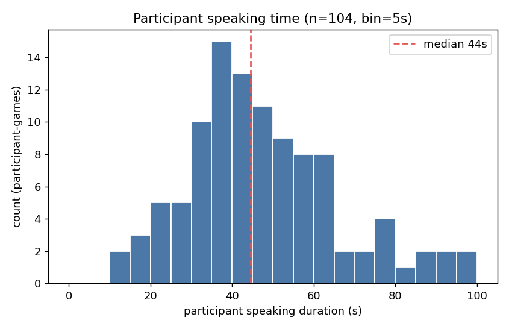

# P6 提案（音図をロボットの行動決定に組み込む）

> 背景 / 決定 / 必然性の分析 / 企画書フォーマットは同ディレクトリの **`context.md`** を参照。本ファイルは**指導教員向けの提案本文**であり、簡潔さを重視する。
> 目標：**2026-07-22 まで**に指導教員へ送付。言語：中国語のワーキングドラフト、送付時に日本語へ別途翻訳。

---

## 1. P6 では PSSP（音図予測）を中心としない

P3–P5 は「将来の音源を予測する（PSSP）」路線で進めてきたが、P5 の統制実験（13 組 / 39 名）から次のことが示された：

- **精度不足**：+1 秒先の話者予測は、二者択一でも **54.8%** にとどまる（ベースライン 50%）。
- **効果が不明瞭**：予測駆動の注視について、その印象上の価値は**検出されなかった**。

予測は十分に正確でもなく、便益も明瞭でないため、**P6 では PSSP（次の音源位置の予測）を中心としない**。

---

## 2. 次の実験の狙い

### 2.1 博士論文の主軸ストーリー（P1–P3）

**博士論文（仮題）：《視覚と音響情報を融合したロボットの能動的行動決定システム》**——実世界の多人数インタラクションの現場で、ロボットがセンサ入力から自律的に「**いつ、誰に、どのような動作をするか**」を決定する。システムは 2 つの軸で進める：**モダリティ**（視覚 → 音響を追加）と**学習方式**（人の実演の模倣 → 自律探索の強化学習 → 事前学習済み VLM の活用）。

- **P1**：商業施設の接客アンドロイド。**視覚 + 専門家（遠隔操作）の実演**による IRL で、実現場において人間の操作者水準を達成。
- **P2**：同一タスクを、**視覚 + 自律探索**の RL で。現場での自己改善により、**熟練操作者を上回る**。
- **P3**：**音図（sound map）を、視覚と融合しうる新たなモダリティとして確立**（対話に関連する空間的手がかりを担う）。

### 2.2 博士論文における P6 の価値

P1-2 の行動決定は**視覚のみ**（「最も近い顔」を見る）であり、多人数かつ**話者がロボットに正対していない**場面では対象を誤る。P6 ＝ **P3 で確立した音図を行動決定に統合し**、音図が視覚 / 言語では解けない対象選択を補えることを示す。これにより博士論文は 1 本の線につながる：**視覚のみの行動決定（P1-2）→ 音図モダリティの確立（P3）→ 視覚 + 音図の行動決定（P6）**。

### 2.3 実現手段（2 つのアプローチ）

- **アプローチ 1（P1-2 路線 / RL、副次的・代替案）**：P1-P2 を踏襲し、音図を RL の入力モダリティに組み込み、**事前定義した離散動作**の中で行動決定を学習する（P1-2 との連続性のため）。
- **アプローチ 2（VLM 路線、主路線）**：**事前学習済み VLM（ファインチューニングなし）**を用い、プロンプトで行動決定を導出する。

### 2.4 アプローチ 2 を優先する理由

- **VLM の利点**：事前学習済み VLM は大規模な視覚-言語の常識と推論をすでに備えており、**大量データによるファインチューニングは不要**。直接プロンプトするだけで「何が見えているか、どこから聞こえるか、誰が何を言ったか」を行動決定（どの事前定義動作を選ぶか）に写像でき、実装が速く社会実装しやすい。
- **VLM は RL 路線より優れる**：追加のモデル学習が不要であり、かつ**音図の重要性をよりクリーンに評価できる**——RL は「動作の学習」と「音図の知覚」を混在させてしまうが、VLM（学習なし）では音図が決定に与える影響のみを考慮できる。
- **なぜ VLA をやらないか**：「音図を加える」という貢献点を示すには VLM で十分。VLA は VLM を通した後の**次のステップ**として進めうる。

### 2.5 システムの入出力

- **入力**：① **RGB またはグレースケール画像**（現場のシーン、必要に応じて semseg 意味分割を追加可）② **音図**（各方向の音源 / DoA）③ **言語**（発話認識。**遠隔操作者**または**ロボットの対話相手**から）。
- **出力**：ロボットの**事前定義動作**——**事前定義した発話**（固定の台詞）または**身体動作**（注視 / 向き変え / ジェスチャ）を含む。

---

## 3. 応用シナリオの提案

> 選定基準：**視覚のみでは満足な効果が得にくい、あるいは誤りやすい**タスクで、**音図の追加により性能が向上する**もの。

### 3.1 会話ファシリテータ・ロボット（Word Wolf 等のゲーム型対話）

- **タスク**：ロボットが複数のプレイヤーを相手に自由対話ゲーム（例：**Word Wolf**）を進行する。プレイヤーの発言頻度は不均一で（ほとんど話さない人がしばしばいる）、ロボットはファシリテータを務める——現在の話者を注視し、間（ポーズ）で**沈黙している人の発言を促し**、**長時間発言を独占する（発言を占有する）プレイヤーを注意し**、適時にうなずく。
- **なぜ音図が重要か**：「誰が話しているか / 誰がどれだけ沈黙しているか」を正確に判断するのは視覚では難しいが、音図（sound map の時系列動態）はそれができる。
- **なぜ会議ではなくゲームか**：会議は多くが**順番の報告**であり、「誰がもっと話すべきか」はそもそも定義されない。一方 Word Wolf のようなゲームでは**全員が積極的に発言すること自体が目的**であり（沈黙する人はゲームを壊す）、「沈黙者を促す」ことに正当な目標が生まれ、「参加の均等化」も評価可能な自然な指標になる。
- **動機（P5 データが裏付け）**：P5 の 13 組 × game3–6（52 試合）において、対面参加者の発話時間は総じて不均一だった——**約 190 秒のゲーム 1 試合で、対面参加者の約 15% は全試合を通じて発話が 30 秒以下、約 49% は 44 秒以下**（≒全体の 1/6 と 1/4。中央値約 44 秒、n=104）であり、確かに促しを要する「沈黙プレイヤー」が存在する。下図は対面参加者の発話時間（pool 後 n=104、bin=5s）の分布で、明瞭な下端のテールが見られる：

### 3.2 注文取りロボット

- **タスク**：食卓の前で複数の客に一人ずつ注文を取る。ロボットは**現在注文しようとしている人を正しく向き**、注文を進める必要がある。
- **なぜ音図が重要か**：客はしばしばメニューを見つめる / 連れの注文を見るなどして**ロボットに正対しておらず**、視覚による話者判定は失敗する。同卓の多人数ではさらに「A を見て B に尋ねる」誤りが起きやすい。音図はアクティブな話者の方位を即時に与えるため、「今まさに注文を口にしたこの一言」を、具体的にどの客のものかへ正しく対応づけられる。

### 3.3 早押しゲーム・ロボット

- **タスク**：ロボットが出題し、2 名以上のプレイヤーが早押しで回答する——目の前のベルを先に鳴らした者が先に答える。ロボットは**ベルの先後を判定し**、先に押した者を指名して回答させ、採点し、次の問題を出す必要がある。
- **なぜ音図が重要か**：複数人がほぼ同時に押した場合、「誰が先か」は**視覚のみでは誤りやすい**（フレームレート / 動作のブレ / 遮蔽）。音図はベル音の**時間的先後と方位**の弁別がより正確で、ベルの順序判定はこのタスクの核心である。

### 3.4 ティッシュ配りロボット（音図の必然性は弱い）

- **タスク**：定位置（駅前 / 街角）で通行人に広告ティッシュを渡す。誰に渡すか、いつ渡すか、声をかけるか否かを決める。
- **なぜ音図が重要か**：候補者が**話している / 会話中か**を判断して対象とタイミングを選ぶ（会話を遮らず、手の空いた人を選ぶ）。**ただし全体としては視覚主導**であり、音図が貢献するのは「タイミング / 受け取り率」にとどまる。

---

## 4. 実装（各シナリオ × 2 アプローチ）

### 4.0 2 アプローチ共通のレシピ（一度だけ記す）

- **アプローチ 2（VLM、主路線）**：入力＝画像 + 音図表現（方位角 + 強度のテキスト、または画像への重畳）+ 言語。**事前学習済み VLM（ファインチューニングなし）**でプロンプトし「どの事前定義動作を選ぶか」（JSON）を出力。
- **アプローチ 1（RL、代替案）**：入力＝RGB / グレースケール画像 + 音図（semseg 追加可）を**チャネルとして積層**して CNN に入力。出力＝事前定義の離散動作。学習＝IRL→RL（P1-2 を踏襲）。
- **両者とも 音図 有 / 無 の ablation を行い**、音図の価値を示す。
- **共通の実装リスク**：① **アプローチ 2 の VLM のリアルタイム遅延**（ローカルの小型モデル / 頻度低減 / キャッシュが必要な場合あり）② **音図を VLM にどう表現するか**（方位角のテキスト、または画像への重畳）。

### 4.1 会話ファシリテータ・ロボット（Word Wolf 版）

- **事前定義動作セット**（ロボットは純粋なファシリテータであり、ゲーム内容には参加しない。ゲーム本体の自由発話は**遠隔操作者**が担い、システムは以下の事前定義動作のみを決定する）：
  - *頭部 / 身体動作*：(1) `look_at(プレイヤー i)`（注視。現在の話者と招待対象を含む）、(2) うなずき
  - *言語動作*：(3) 相槌（「うん / なるほど」等、簡潔で固定の backchannel）
  - *遠隔操作者への提示*：(4) `invite(プレイヤー i)`——**頭部を当該プレイヤーへ向ける** ＋ **遠隔操作インターフェース**上に「○○に発言を促すべき」というヒントを遠隔操作者へ提示（招待の言葉は操作者が発し、ロボットは固定音声を再生しない）。(5) `moderate(プレイヤー i)`——**発言を独占する（長時間占有する）者**に対し、頭部を当該プレイヤーへ向ける（あるいは話者交替を促すために他のプレイヤーへ向ける）＋ 遠隔操作インターフェース上に「○○が発言を独占しすぎ、注意 / 譲るべき」というヒントを遠隔操作者へ提示。
  - (6) `idle`
- **中核の研究上の決定**：**すべての動作決定（注視対象を含む）は VLM / RL が出力し、DoA 等のルールは設けない**。中核は、**あるプレイヤーが「沈黙が長すぎる」ので invite すべきか、あるプレイヤーが「独占が長すぎる」ので moderate すべきかを、いつ、誰に対して判定するか**（invite / moderate ＝頭部の向き変え ＋ 遠隔操作者への提示。身体動作と提示は同時にトリガ）。
- **モデル入力**：
  - 画像（現場のシーン）
  - 音図の時系列動態：現在の話者方位、各プレイヤーの累積発話時間、各プレイヤーの沈黙時間、重複 / 割り込みの有無
  - 言語：発話認識結果
- **アプローチ 2**：上記の発話動態 + 視覚シーンをプロンプトへ → VLM が動作を出力。
- **アプローチ 1**：画像 + 音図チャネル → RL が動作を選択。
- **データ活用（本案独自の優位性）**：
  - *オフライン*：**Word Wolf 実験で収集したゲームデータ**を用いて「発話動態抽出器」を構築し、**視覚のみ vs 視覚 + 音図**の対象判定を比較（クリーンな必然性の証拠）。
- **指標**：注視対象の正解率（音図 有 / 無）、**参加の均等化**（各プレイヤーの発話時間の均衡度。時間比 / ジニ係数など）、**沈黙者の誘導成功率**（invite 後に当該プレイヤーが発言したか）。
- **注（P5 との差別化、必記）**：宿主は Word Wolf だが、研究課題＝「**音図の動態が、正しいファシリテーション行動決定（沈黙者の誘導、参加の均衡）を支えられるか**」であり、P5 の**予測型注視 × 印象**（これは無効と実証済み）でも、PSSP 予測でもない。反応型・音図駆動で、目標は参加の均等化。

### 4.2 注文取りロボット

- **事前定義動作セット**（注文内容そのもの＝具体的な品目の聞き取りは**遠隔操作者**が担い、システムは以下の事前定義動作のみを決定する）：
  - *頭部 / 身体動作*：(1) 客 i を向く
  - *言語動作（固定の台詞）*：(2) 「準備ができたらご注文どうぞ」と言う、(3) 「こちらお決まりですか」と言う
  - (4) 終了
- **モデル入力**：
  - 画像（食卓シーン）
  - 音図：各座席方向のアクティブな話者の強度 / 方位
  - 過去の注文履歴（各客が注文済み / 未注文 / 何を注文したか）
  - 言語：発話認識結果
- **アプローチ 2**：状態記述をプロンプトへ → VLM が `{look_at, say, done}` を出力。
- **アプローチ 1**：状態（画像 + 音図チャネル + 各人の注文済み / 未注文）→ RL が離散動作を選択。
- **指標**：注視対象の正解率、注文完了度（聞き漏らし / 重複質問）。

### 4.3 早押しゲーム・ロボット

- **事前定義動作セット**：
  - *頭部 / 身体 ＋ 言語*：(2) プレイヤー i を指名して回答させる（当該プレイヤーへ向き変え ＋ 指名）
  - *言語 / 進行動作*：(1) 出題、(3) 正誤判定と採点、(4) 次の問題
- **モデル入力**：
  - 画像
  - 音図：各ベル方向の**音イベントとそのタイムスタンプ**（誰が先に鳴らしたか、どの方位から鳴ったか）
  - 言語：プレイヤーの回答認識
- **アプローチ 2**：ベルイベント（方位 + 時系列）をプロンプトへ → VLM が先に鳴らした者を指名。
- **アプローチ 1**：画像 + 音図チャネル → RL が動作を選択。
- **指標**：**先後判定の正解率**（音図 有 / 無の比較）、帰属誤判定率。
- **注**：本タスクの行動決定自体は単純（先に鳴らした者を指名）で、価値は**音図によるベル順序 / 方位の精密判定**に集中する → 音図知覚の優位性を最もクリーンに示すデモである。

### 4.4 ティッシュ配りロボット

- **事前定義動作セット**：
  - *頭部 / 身体動作*：(1) 誰かに差し出す、(4) 引っ込める
  - *言語動作*：(2) 「どうぞ」と言う
  - *その他*：(3) 待機
- **モデル入力**：
  - 画像
  - 音図：各方向の発話活動（誰が話している / 会話中か）＋ 声をかけるべき対象の方位
  - 言語：発話認識結果
- **アプローチ 2**：状態をプロンプトへ → VLM が動作を出力。
- **アプローチ 1**：画像 + 音図チャネル → RL が動作 / タイミングを選択。
- **指標**：受け取り率、遮断率（話している人に渡してしまったか）。

---

## 5. 関連研究（差別化）

- **Active Speaker Detection（視聴覚アクティブスピーカー検出、AVA-ActiveSpeaker / TalkNet 等）**：「誰が話しているか」と直接重なる。差別化＝これらは**顔が見えている必要がある**が、本案は**顔が使えない（正対していない）ときに音図の方位に頼る** regime を主眼とする。
- **Robot audition / 音源定位（HARK 等）**：本研究室の文脈と親和的。
- **Addressee detection / multiparty HRI**：誰がロボットに話しかけているか、多者間の注視管理。
- **VLM-as-policy**：事前学習済み VLM でロボット行動をプロンプトする。
- **位置づけ**：「誰が話しているか」単体では新しくない（ASD は成熟）。新規性＝① 音図をモダリティとして行動決定へ入れる、② AV-ASD が失効する「正対しない」regime、③ ファインチューニングなし（アプローチ 2）/ P1-2 の踏襲（アプローチ 1）。
