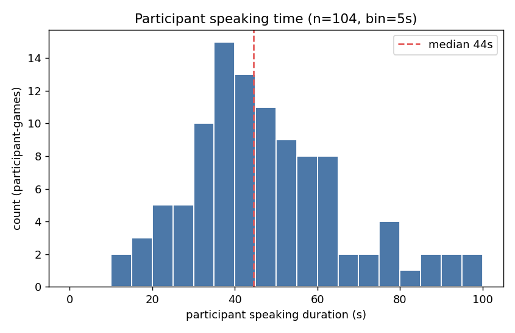

# P6 提案（把音图加入机器人的行为决策）

> 背景 / 决定 / 必然性分析 / 企划书格式见同目录 **`context.md`**。本文件是**给导师的提案正文**，力求简洁。
> 目标：**2026-07-22 前**发导师。语言：中文工作稿，发导师时另译日文。

---

## 1. P6 不再以 PSSP（音图预测）为中心

P3–P5 沿"预测未来音源（PSSP）"推进，但 P5 统制实验（13 组/39 人）表明：

- **精度不足**：+1 秒话者预测即使在二选一下也仅 **54.8%**（基线 50%）。
- **效果不明显**：预测驱动的注视，其印象价值**未检出**。

预测既不够准、收益也不明显，故 **P6 不再以 PSSP（预测下一声源位置）为中心**。

---

## 2. 下一个实验的狙い

### 2.1 博论的主线故事（P1–P3）

**博论（工作题目）：《融合视觉与音响信息的机器人能动行为决策系统》**——让机器人在真实的多人交互现场，从传感器输入自主决定"**何时、对谁、做什么动作**"。系统沿两条轴推进：**模态**（视觉 → 加入音响）与**学习方式**（人的示范模仿 → 自主探索的强化学习 → 预训练 VLM 的运用）。

- **P1**：商场接客 android，**视觉 + 专家（遥操作）示范**的 IRL，在真实现场达到人类操作者水平。
- **P2**：同任务，**视觉 + 自主探索**的 RL，现场自我改善、**超越熟练操作者**。
- **P3**：**确立音图（sound map）为可与视觉融合的新模态**（携带对话相关的空间线索）。

### 2.2 P6 在博论中的价值

P1-2 的行为决策**只用视觉**（看"最近的脸"），在多人、**说话者不正对机器人**时会选错对象。P6 ＝ **把 P3 确立的音图并入行为决策**，证明音图能补上视觉/语言解决不了的对象选择。博论由此连成一条线：**仅视觉的行为决策（P1-2）→ 音图模态的确立（P3）→ 视觉+音图的行为决策（P6）**。

### 2.3 实现手段（两个角度）

- **角度 1（P1-2 路线 / RL，次要 / 备选）**：沿 P1-P2，把音图并入 RL 输入模态，在**预设离散动作**中学习行为决策（承接 P1-2，用于博论连贯性）。
- **角度 2（VLM 路线，主路线）**：用**预训练 VLM（不 finetune）**，prompt 出行为决策。

### 2.4 优先角度 2 的理由

- **VLM 的好处**：预训练 VLM 已具备大规模的视觉-语言常识与推理，**无需大数据 finetune**，直接 prompt 就能把"看到什么、听到哪、谁说了什么"映射到行为决策（选哪个预设动作），落地快、易社会实装。
- **VLM 比 RL 路线更好**：不用额外训练模型；且能**更干净地评估音图的重要性**——RL 会把"动作学习"和"音图感知"混在一起，而 VLM（不训练）只考量音图对决策的影响。
- **为什么不做 VLA**：VLM 已足以证明"加入音图"的贡献点；VLA 可作为 VLM 跑通之后的**下一步**推进。

### 2.5 系统输入输出

- **输入**：① **RGB 或灰度图像**（现场场景，必要时可加 semseg 语义分割）② **音图**（各方向声源 / DoA）③ **语言**（发话识别，来自**远程操作者**或**机器人的交互对象**）。
- **输出**：机器人的**预设动作**——含**预设语音**（固定话术）或**肢体动作**（注视 / 转向 / 手势）。

---

## 3. 应用场景提案

> 选取标准：任务**仅凭视觉难以达到满意效果或容易出错**，而**加入音图能提升表现**。

### 3.1 会话 facilitator 机器人（Word Wolf 等游戏型对话）

- **任务**：机器人面对多名玩家进行一场自由对话游戏（如 **Word Wolf**），玩家发言频率不均（常有人几乎不说话）；机器人当 facilitator——注视当前说话者、在停顿处**引导沉默者发言**、对**长时间独占发言（霸麦）的玩家加以提醒**、适时点头。
- **为什么音图重要**：视觉难以精确判断"谁在说 / 谁沉默多久"；音图（sound map 时序动态）能。
- **为什么用游戏而非会议**：会议多是**轮流汇报**，"谁该多说"本无定义；而 Word Wolf 这类游戏里**全员踊跃发言本身就是目的**（沉默的人破坏游戏），"引导沉默者"才有正当目标，"参与均等化"也才成为可评价的自然指标。
- **动机（P5 数据坐实）**：P5 的 13 组 × game3–6（52 场）中，对面参加者的发话时长普遍不均——**一场约 190 秒的游戏里，约 15% 的对面参加者整场发话不超过 30 秒、约 49% 不超过 44 秒**（≈全场的 1/6 与 1/4；中位约 44 秒，n=104），确有需要引导的"沉默玩家"。下图为对面参加者发话时长（pool 后 n=104，bin=5s）的分布，可见明显的低端尾巴：

### 3.2 点单机器人

- **任务**：餐桌前为多位客人逐个点单，机器人须**正确看向当前要点单的人**并推进点单。
- **为什么音图重要**：客人常盯菜单 / 看同伴点单、**不正对机器人**，视觉说话者判定失效；多人同桌更易"看 A 问 B"。音图即时给出活跃说话者的方位，从而把"现在开口点单的这句话"正确对应到具体是哪位客人。

### 3.3 抢答游戏机器人

- **任务**：机器人出题，两名以上玩家抢答——谁先按响面前的铃铛谁先答。机器人须**判定铃响的先后**并指名先按者作答、判分、出下一题。
- **为什么音图重要**：多人几乎同时按铃时，"谁先响"**仅凭视觉容易出错**（帧率 / 动作模糊 / 遮挡）；音图对铃声的**时间先后与方位**分辨更精准，铃响顺序判定是任务核心。

### 3.4 分发纸巾机器人（音图必然性弱）

- **任务**：固定位（车站口 / 街角）向路过的人递广告纸巾，决定向谁递、何时递、要不要出声招呼。
- **为什么音图重要**：判断候选者**是否正在讲话 / 交谈**以选对象与时机（不打断、挑有空的人）。**但整体偏视觉主导**，音图只贡献"时机 / 接受率"。

---

## 4. 实现（每场景 × 两角度）

### 4.0 两角度通用配方（只说一次）

- **角度 2（VLM，主路线）**：输入＝图像 + 音图表示（方位角+强度的文本，或叠加到图像）+ 语言；**预训练 VLM（不 finetune）** prompt 出"选哪个预设动作"（JSON）。
- **角度 1（RL，备选）**：输入＝RGB / 灰度图 + 音图（可加 semseg）**堆叠成通道**喂 CNN；输出＝预设离散动作；学习＝IRL→RL（承接 P1-2）。
- **两者都做 有 / 无音图 的 ablation** 证明音图价值。
- **共同实现风险**：① **角度 2 的 VLM 实时延迟**（或需本地小模型 / 降频 / 缓存）② **音图如何表示给 VLM**（文本方位角，或叠加图像）。

### 4.1 会话 facilitator 机器人（Word Wolf 版）

- **预设动作集**（机器人是纯 facilitator，不参与游戏内容；游戏本身的自由发话由**远程操作者**接，系统只决定以下预设动作）：
  - *头部 / 肢体动作*：(1) `look_at(玩家 i)`（注视，含当前说话者与被邀请者）、(2) 点头
  - *语言动作*：(3) 相槌（"うん / なるほど"，简短固定 backchannel）
  - *对远程操作者的提示*：(4) `invite(玩家 i)`——**头部转向该玩家** ＋ 在**远程操作界面**把"该邀请○○发言"作为提示给远程操作者（由操作者说出邀请话，机器人不播固定音频）；(5) `moderate(玩家 i)`——针对**霸麦（长时间独占发言）者**，头部转向该玩家（或转向其他玩家以转移话轮）＋ 在远程操作界面把"○○独占发言太久、该提醒 / 让位"作为提示给远程操作者
  - (6) `idle`
- **核心研究决策**：**所有动作决策（含注视对象）都由 VLM / RL 输出，不设 DoA 等规则**。核心是**何时判定某玩家"沉默过久"该 invite、或某玩家"霸麦过久"该 moderate，以及对谁做**（invite / moderate ＝头部转向 ＋ 提示远程操作者，肢体与提示同时触发）。
- **模型输入**：
  - 图像（现场场景）
  - 音图时序动态：当前说话者方位、各玩家累计发话时长、各玩家沉默时长、是否重叠 / 抢话
  - 语言：发话识别结果
- **角度 2**：上述发话动态 + 视觉场景进 prompt → VLM 输出动作。
- **角度 1**：图像 + 音图通道 → RL 选动作。
- **数据利用（本案独有优势）**：
  - *离线*：利用 **Word Wolf 实验收集到的游戏数据**，建"发话动态提取器"并做 **视觉-only vs 视觉+音图** 的对象判定对比（干净的必然性证据）。
- **指标**：注视对象正确率（有 / 无音图）、**参与均等化**（各玩家发话时长的均衡度，如时长比 / 基尼系数）、**沉默者被成功引导率**（invite 后该玩家是否开口）。
- **注（P5 差异化，必写）**：宿主虽是 Word Wolf，但研究问题＝"**音图动态能否支撑正确的 facilitation 行为决策（引导沉默者、均衡参与）**"；**不是** P5 的**预测型注视 × 印象**（那条已证无效），也不是 PSSP 预测。反应型、音图驱动、目标是参与均等化。

### 4.2 点单机器人

- **预设动作集**（点单内容本身＝听取具体菜品由**远程操作者**接，系统只决定以下预设动作）：
  - *头部 / 肢体动作*：(1) 看向客人 i
  - *语言动作（固定话术）*：(2) 说"准备好了就点单哦"、(3) 说"您这边看好了吗"
  - (4) 结束
- **模型输入**：
  - 图像（餐桌场景）
  - 音图：各座位方向的活跃说话者强度 / 方位
  - 过去的点单记录（各客人已点 / 未点 / 点了什么）
  - 语言：发话识别结果
- **角度 2**：状态描述进 prompt → VLM 输出 `{look_at, say, done}`。
- **角度 1**：状态（图像 + 音图通道 + 各人已点 / 未点）→ RL 选离散动作。
- **指标**：注视对象正确率、点单完成度（漏点 / 重复问）。

### 4.3 抢答游戏机器人

- **预设动作集**：
  - *头部 / 肢体 ＋ 语言*：(2) 指名玩家 i 作答（转向该玩家 ＋ 点名）
  - *语言 / 流程动作*：(1) 出题、(3) 判定对错并给分、(4) 下一题
- **模型输入**：
  - 图像
  - 音图：各铃铛方向的**声音事件及其时间戳**（谁先响、响自哪个方位）
  - 语言：玩家作答识别
- **角度 2**：铃响事件（方位 + 时序）进 prompt → VLM 指名先响者。
- **角度 1**：图像 + 音图通道 → RL 选动作。
- **指标**：**先后判定正确率**（有 / 无音图对比）、误判归属率。
- **注**：本任务行为决策本身简单（指名先响者），价值集中在**音图对铃响顺序 / 方位的精准判定** → 是音图感知优势最干净的 demo。

### 4.4 分发纸巾机器人

- **预设动作集**：
  - *头部 / 肢体动作*：(1) 向某人递出、(4) 收回
  - *语言动作*：(2) 说"どうぞ"
  - *其他*：(3) 等待
- **模型输入**：
  - 图像
  - 音图：各方向的发话活动（谁在讲话 / 交谈）＋ 出声要者的方位
  - 语言：发话识别结果
- **角度 2**：状态进 prompt → VLM 输出动作。
- **角度 1**：图像 + 音图通道 → RL 选动作 / 时机。
- **指标**：接受率、打断率（是否递给了正在讲话的人）。

---

## 5. 关联研究（差异化）

- **Active Speaker Detection（视听主动说话者检测，AVA-ActiveSpeaker / TalkNet 等）**：与"谁在说话"直接重叠；差异化＝它们**需看得见脸**，本案主打**脸不可用（不正对）时靠音图方位**的 regime。
- **Robot audition / 声源定位（HARK 等）**：本研究室脉络亲和。
- **Addressee detection / multiparty HRI**：谁在对机器人说话、多方注视管理。
- **VLM-as-policy**：用预训练 VLM prompt 出机器人行为。
- **定位**：单看"谁在说话"不新（ASD 成熟）；新意＝①音图作为模态喂进行为决策、②AV-ASD 失效的"不正对"regime、③不 finetune（角度 2）/ 承接 P1-2（角度 1）。
